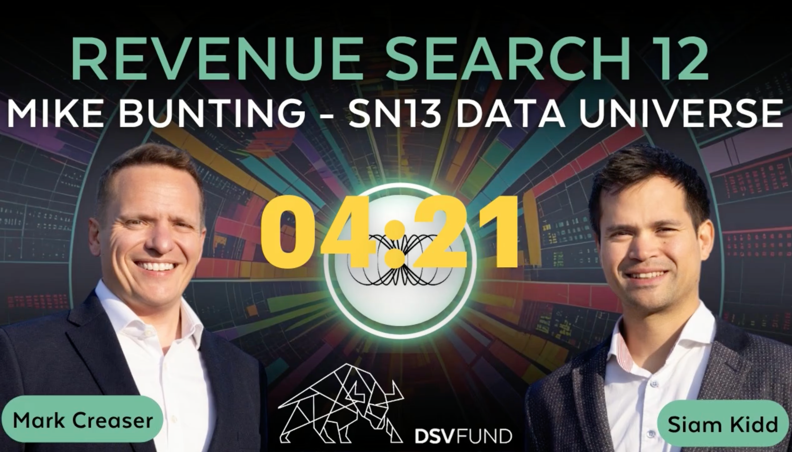

# Macromedia

***

## Is this the decentralised version of Cambridge Analytica?



***

## 💎 Bittensor Hidden Gem - Explosive Project Ready To Pop



***

## Data Universe: Was Google & Meta geheim halten, ist jetzt öffentlich! (Bittensor Subnet)



***

## DoesThis Bittensor (TAO) Subnet Have 10X Potential?



***

## 🚨Will Barry Silbert Pump Bittensor TAO Like Zcash? Full Breakdown & Prediction



***

## This TAO Project Is Changing EVERYTHING For Data!



***

## Bittensor Brief #14: Data Universe (Subnet 13)



***

## Can Data Make You Rich in 2025?



***

## Why Big Tech Is Scared of the Bittensor [#TAO](https://www.youtube.com/hashtag/tao) explosion (SN13 Data Universe Explained)



***

## This Bittensor Subnet Could Be HUGE! | Bittensor (TAO) Update



***





[Revenue Search 12](https://x.com/i/broadcasts/1zqKVjXBDrdKB)

<figure><figcaption></figcaption></figure>









Partnering between Rowan and Macrocosmos to Accelerate Next-Generation NNP Development

[<mark style="color:blue;">Neural network potentials (NNPs) are revolutionizing molecular simulation. Starting today, Rowan is teaming up with Macrocosmos, an open-source AI research lab building on Bittensor, to accelerate the development of the next generation of NNPs through Subnet 25 - Mainframe.</mark>](https://www.rowansci.com/blog/partnering-with-macrocosmos?utm_source=substack\&utm_medium=email)

Macrocosmos SDK Introduction



***

#### Venture Labs EP. 32&#x20;



***

#### Hash Rate - Ep 98: A Tour of Five TAO Subnets



***

**How do you choose subnets? Learn from the best here 👇**



***

Our CTO, Steffen Cruz, discusses #DeepSeek, the future of open-source models, Bittensor’s opportunity to push the AI landscape, and how Subnet 9 utilizes dataset mixing to trigger SOTA pre-training results.



***

Tune in mainly to catch that Bittensor Guru is back, but our founders Will Squires and Steffen Cruz also had a few things to say, as well as a brief tour of our office - shout out to the featured cosmonauts.



