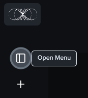

# FAQs

**Is Apex free? -** 2.5M tokens are provided for free for the first login. The [pricing page](../../pricing.md) provides more details. &#x20;

**Does Apex have memory or chat history? -** Yes. Access to it is through the Open Menu icon.

<figure><figcaption></figcaption></figure>

**How fresh is the data? -** Web-enhanced answers reflect real-time web content. Other models rely on pre-trained LLMs.

**How can I share feedback or report bugs? -** You can share feedback directly in our Macrocosmos Discord, through the email support@macrocosmos.ai or submit an issue [here](https://github.com/macrocosm-os/macrocosmos-content/issues).
