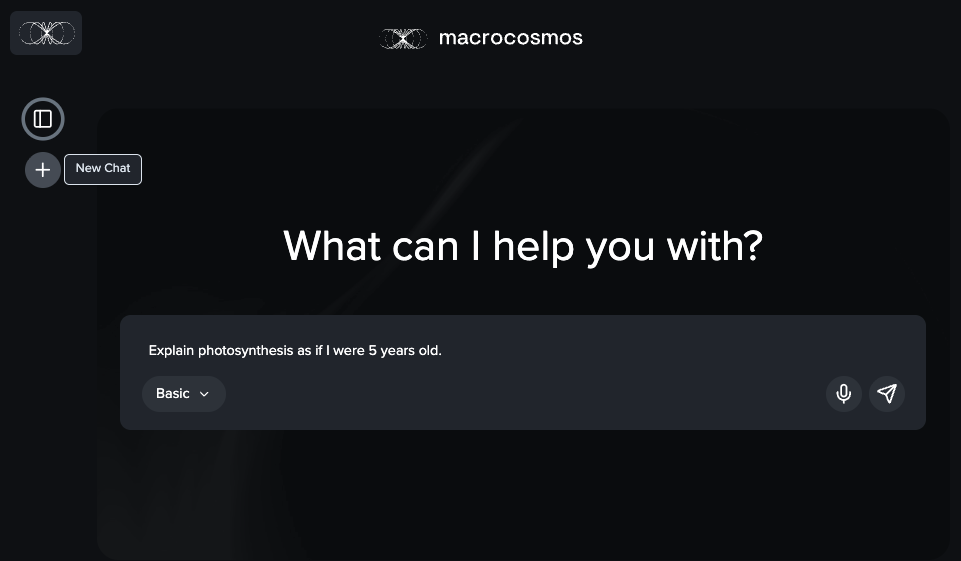

# Navigating Apex

#### Navigate to [Constellation](https://app.macrocosmos.ai/) to access Apex.

No login required – open access for demo purposes.

#### Prompting

Ask any question or click a New chat to start a new conversation.

<figure><figcaption></figcaption></figure>

#### **Model Selector**

We have various models for you to choose from . Click the `Basic`button for a drop down menu on all the models available on Apex . Choose between different models depending on your needs.

<figure><figcaption></figcaption></figure>

| **Model**             | **What It Does**                                  | **Best For**                           |
| --------------------- | ------------------------------------------------- | -------------------------------------- |
| **Apex Basic**        | Fast, general-purpose LLM                         | Everyday questions, summaries          |
| **Apex Combined**     | Aggregated results from multiple miners           | Balanced answers, wider consensus      |
| **Apex Web Enhanced** | Adds real-time web retrieval to LLM               | Information on current news and events |
| **Apex Reasoning**    | Deeper logic leveraging advanced reasoning skills | Research, arguments, nuanced queries   |
