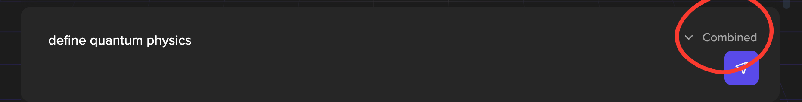

# Navigating Apex

#### Navigate to [Constellation](https://app.macrocosmos.ai/) to access Apex.

No login required – open access for demo purposes.

#### Prompting

Click the `NEW CHAT +` to initiate a new chat, You can ask any question!

<figure><figcaption></figcaption></figure>

#### **Model Selector**

We have various models for you to choose from . Click the`Basic`button for a drop down menu on all the models available on Apex . Choose between different models depending on your needs.

<figure><figcaption></figcaption></figure>

| **Model**                 | **What It Does**                                            | **Best For**                           |
| ------------------------- | ----------------------------------------------------------- | -------------------------------------- |
| **Apex Basic**            | Fast, general-purpose LLM                                   | Everyday questions, summaries          |
| **Apex Combined**         | Aggregated results from multiple miners                     | Balanced answers, wider consensus      |
| **Apex Web Enhanced**     | Adds real-time web retrieval to LLM                         | Information on current news and events |
| **Apex Chain of Thought** | Our highly intelligent model but for step-by-step reasoning | Math, logic, planning                  |
| **Apex Reasoning**        | Deeper logic leveraging advanced reasoning skills           | Research, arguments, nuanced queries   |

#### Switching between Models

Click the dropdown button on the right side of the response box, and select a different model of your choice.

<figure><figcaption></figcaption></figure>

Click the regenerate response button 🔄 to run your prompt through the model you selected . A new response will be generated , allowing you to compare output from both models.

**You can also interact with Apex using our APIs . Click here to access** [api-documentation](../../developers/api-documentation/ "mention")
