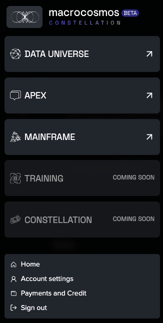
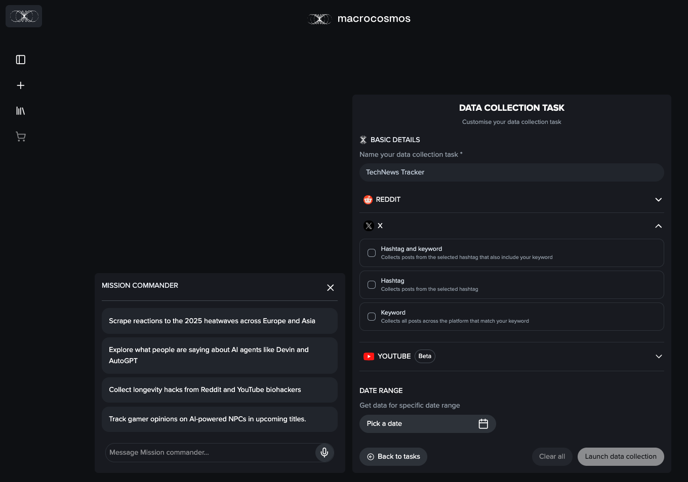
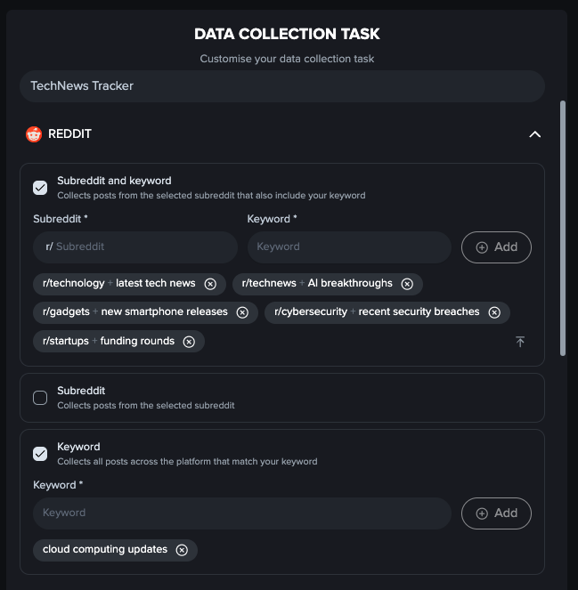
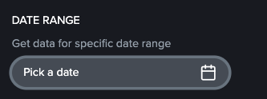
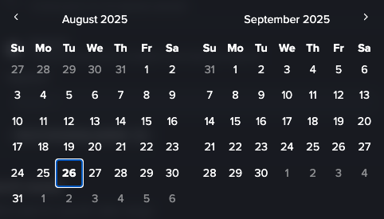
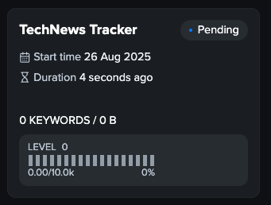

# Scraping Data

#### Navigate to [Macrocosmos Constellation](https://app.macrocosmos.ai/) to access Gravity and simply click Data Universe.

#### Use the Macrocosmos icon to navigate the menu

<figure><figcaption></figcaption></figure>

#### **Create a New Task to collect data**

You might be interested in building an app that tracks public reactions to new tech launches.\
You want live posts from Reddit, X and Youtube.

<figure><figcaption></figcaption></figure>

**Step 1:** Name your task. For Example: **`TechNews Tracker`**

**Step 2:** Specify your data source, or scrape from any!

**Step 3:** Define your keywords. Tell Gravity what to find.

<figure><figcaption></figcaption></figure>

#### Mission Commander

Mission Commander (MC), our specialized AI assistant can also help provide the relevant keywords for you task, all you have to do is ask! Mission commander is powered by [subnet-1-apex](../../subnets/subnet-1-apex/ "mention")

**Step 1: Write a request**

Start by telling MC what type of data you'd like to collect.

<figure><figcaption></figcaption></figure>

**Step 2. Correct the labels and keywords, if needed**

If the labels aren't quite right, you can edit manually or ask mission commander to fix it.

<figure><figcaption></figcaption></figure>

**Step 3: Pick a date range**

Pick the dates if you would like to define period when the data was published.

<figure><figcaption></figcaption></figure>

<figure><figcaption></figcaption></figure>

**Step 4: Launch the Task**

Once you’re happy with the request and the label setup, hit **Launch data collection**. You will be automatically redirected to your task library. Your task will be deployed and the data will satrt to be collected in real time.

<figure><figcaption></figcaption></figure>

**You can also interact with Gravity using our APIs . Click here to access** [**Subnet 13 Gravity API**](../../developers/macrocosmos-sdk/gravity.md)**.**
