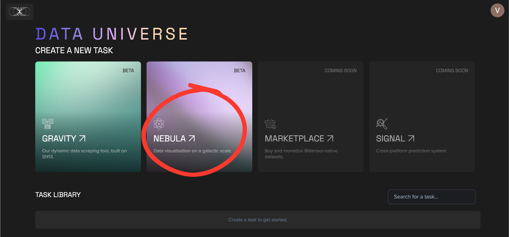

# Explore Nebula

#### Navigate to [Constellation](https://app.macrocosmos.ai/gravity/tasks) and Click Nebula

Simply Click Nebula&#x20;

<figure><figcaption></figcaption></figure>

Nebula loads a live visualization of messages from the **Bittensor Discord server**

#### Search for any Keyword&#x20;

Type in any keyword or phrase to highlight relevant messages.

<figure><figcaption></figcaption></figure>

#### **Scatter Plot**

Each dot represents a Discord message embedding. The highlighted dots in white show the messages that contain your search query . For example , we searched for the word developer got a few messages highlighted.&#x20;

Lets try with the keyword "Bittensor"&#x20;

<figure><figcaption></figcaption></figure>

Visually, You can see we had alot more search results , and if you hover above the dots, you'll find the relevant messages with the keyword "Bittensor"&#x20;

#### Filter by Time

Use the date range underneath the search bar to select a preferred time period.&#x20;

<figure><figcaption></figcaption></figure>

You’ll see the plot re-render with only the messages from that time range. This helps you analyze discussion trends during specific events or moments.

#### Explore the Embedding Map

Zoom in/out or drag to explore. Messages discussing similar topics cluster together . Even if the exact words differ.

<figure><figcaption></figcaption></figure> <figure><figcaption></figcaption></figure>

