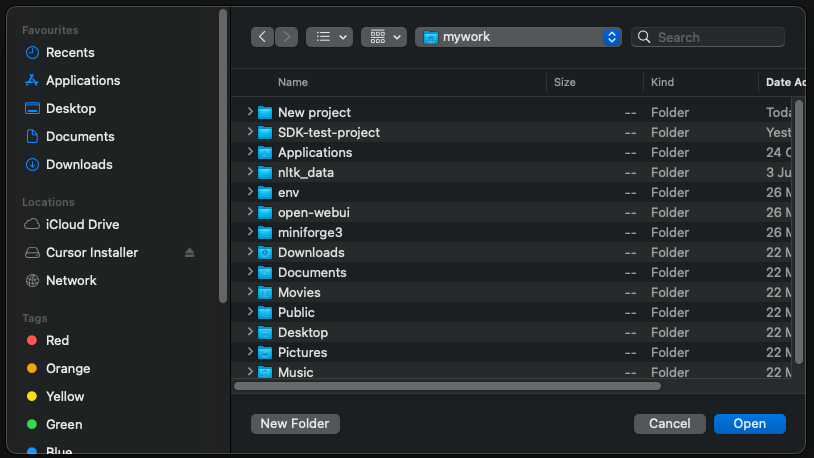
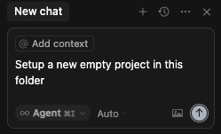
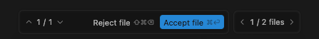
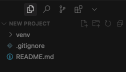

# Get Started

To get started using Macrocosmos Software Development Kit (SDK) you should:

1. Generate your API key using the instruction from the [API Keys](api-keys.md) page
2. Ensure that you are using Python 3.9+ or Typescript

<details>

<summary>How to setup a simple project to run SDK using python in Cursor</summary>

1. Install [Cursor](https://www.cursor.com/) - the basic version is free
2.  From the top menu choose File -> Open and create a new folder for your project.&#x20;

    <figure><figcaption></figcaption></figure>
3.  In your new project folder type at the Chat menu asking to setup a new project:\
    \


    > Cursor is a great tool for the development! It can follow human language instructions helping to setup the project, make it functional and secure, find issues with the code and provide instructions in case of challenges.&#x20;
4.  I have got the next instructions and accepted the files.\


    I'll help you set up a new empty project. First, let me check what's currently in the workspace directory.Listed 0 items in current directoryGreat, I see the directory is empty. I'll help you set up a basic project structure. I'll create:

    1. A README.md file with project information
    2. A .gitignore file for common files to ignore
    3. A basic project structure

    \

5. In the next message ask to create a virtual environment\
   
6. I have accepted the changes and got the result:\
   \
   Perfect! Your virtual environment is now set up and ready to use. Here's what has been done:

1) Created a new virtual environment in the venv directory
2) Activated the virtual environment
3) Verified Python 3.9.6 and pip 21.2.4 are installed

You can now:

* Install packages using pip install \<package-name>
* Run Python scripts in an isolated environment
* When you're done working, you can deactivate the virtual environment by typing deactivate\
  

7. From the top menu choose **File -> New Terminal**
8.  Activate the virtual environment directory

    <pre class="language-python"><code class="lang-python"><strong>#activate the virtual environment directory
    </strong><strong>source venv/bin/activate
    </strong><strong>#activate python
    </strong><strong>python
    </strong></code></pre>

Congratulations! 🎉 You have setup the basic project and now can start to use Macrocosmos SDK through the terminal starting from **pip install macrocosmos** and activating clients for Apex and Gravity, as it described in the document below.\


</details>

### Install the Macrocosmos SDK using pip or npm



```python
pip install macrocosmos
```



```javascript
npm install macrocosmos
```



Macrocosmos SDK should be version 1.0.4+

### Client Setup

The **Client** classes — such as `ApexClient` and `GravityClient` , serve as the **primary interface** between your application and a specific Macrocosmos subnet.



<pre class="language-python"><code class="lang-python"># Import the client
import macrocosmos as mc

# Initialize the client
<strong>client = mc.ApexClient(api_key="")
</strong></code></pre>



```javascript
// Import the client
import { ApexClient } from 'macrocosmos';

// Initialize the client
const client = new ApexClient({ apiKey: 'your-api-key' });
```



When you initialize a client - `ApexClient` or `GravityClient`, you're creating a scoped connection to that subnet. This setup manages authentication via your API key.

### Watch the Demo here


