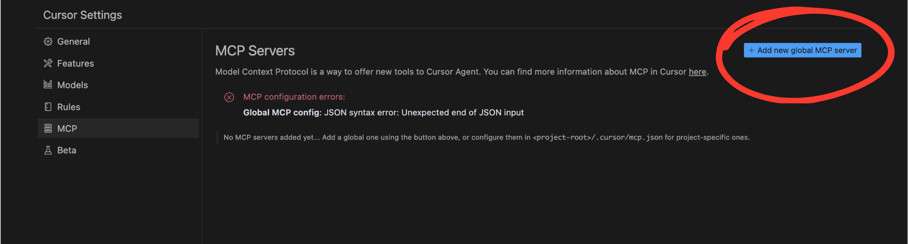
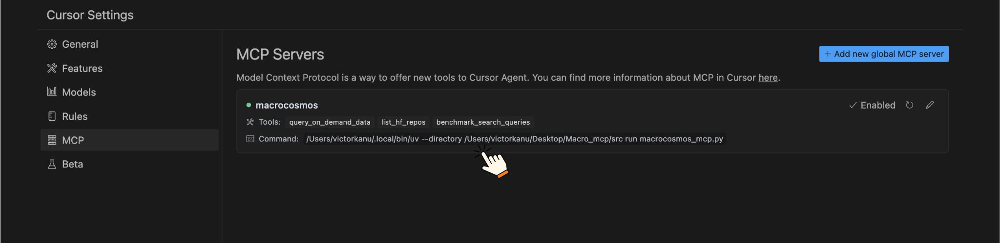
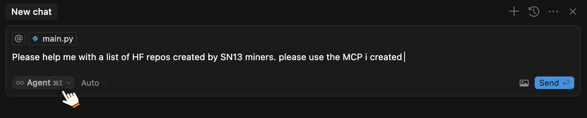

# Macrocosmos MCP

**Macrocosmos MCP** lets you integrate **SN13** and **SN1** APIs directly into **Claude for Desktop** or **Cursor**. Instantly tap into social data, perform live web searches, and explore Hugging Face models — all from your AI environment.

### Features

* 🔍 Query **X** (Twitter) and **Reddit** data on demand
* 🌐 Perform live **web search** using SN1 miners
* 📚 Explore **SN13 Hugging Face** repositories and datasets

###

### Prerequisites

* Python 3.10
* `uv` package manager
* [Install Claude desktop](https://claude.ai/download)
* Install Cursor&#x20;


**Install UV package manager:**



```bash
curl -LsSf https://astral.sh/uv/install.sh | sh
```



```python
pip3 install uv
```




### Server setup instructions

1\. Clone the Repo and Navigate to the project director

```
git clone https://github.com/macrocosm-os/macrocosmos-mcp.git
cd macrocosmos-mcp/src
```

2. Create and activate virtual environment

```bash
uv venv
source .venv/bin/activate
```

3. Initialize the project directory (src)

```bash
uv init
```

4. Install required dependencies

```bash
uv add "mcp[cli]" httpx
```

5. Run the application (Test run the server with uv)

```bash
uv run macrocosmos_mcp.py
```

The script should start and wait for connections. Press Ctrl+C to exit once you've confirmed it works.


6. Get the full path to your `uv` executable:

```bash
which uv
```


Now, please update your Claude Desktop configuration file by running the following command

```bash
code ~/Library/Application\ Support/Claude/claude_desktop_config.json
```


**Update with this:**

```bash
{
    "mcpServers": {
        "macrocosmos": {
            "command": "FULL_PATH_TO_UV",  // Replace with output from `which uv`
            "args": [
                "--directory",
                "/path/to/macrocosmos-mcp",  // Replace with the path to your local clone of macrocosmos-mcp
                "run",
                "src/macrocosmos_mcp.py"
            ],
            "env": {
                "SN1_API_KEY": "your-sn1-api-key",
                "SN13_API_KEY": "your-sn13-api-key"
            }
        }
    }
}

```

Replace "FULL\_PATH\_TO\_UV" with the full path you got from `which uv`.

For instance:

```
/Users/victorkanu/.local/bin/uv
```


##

## Claude Desktop

1. Completely quit Claude Desktop
2. Reopen Claude Desktop
3. Look for the hammer icon to confirm your MCP servers are available . You will find a list of available MCP tools&#x20;

<figure><figcaption></figcaption></figure>


**Watch a demo 👇**




##

## Cursor

1. Navigate to your Cursor settings and select `add new global MCP server`&#x20;

<figure><figcaption></figcaption></figure>


2. **Update your `mcp.json` file**\
   Add the following configuration to your `mcp.json`. This will let you access the available tools.

```
{
    "mcpServers": {
        "macrocosmos": {
            "command": "FULL_PATH_TO_UV",  // Replace with output from `which uv`
            "args": [
                "--directory",
                "/path/to/macrocosmos-mcp",  // Replace with the path to your local clone of macrocosmos-mcp
                "run",
                "src/macrocosmos_mcp.py"
            ],
            "env": {
                "SN1_API_KEY": "your-sn1-api-key",
                "SN13_API_KEY": "your-sn13-api-key"
            }
        }
    }
}

```


<figure><figcaption></figcaption></figure>


3. **Enable Agent Mode in Chat**\
   Make sure you're using **Agent Mode** in the chat. Agents are capable of using a wide range of tools — both custom-built and MCP-provided.

<figure><figcaption></figcaption></figure>

You can now ask questions or give prompts. Be sure to **specify when you want the agent to use MCP tools**.


4. **Tool Usage in Action**\
   When the agent responds, you’ll see it indicate which **MCP tool** it’s using, along with a coherent and context-aware reply.

<figure><figcaption></figcaption></figure>


### Troubleshooting

If you encounter any issues:

1. Ensure you're in the correct directory
2. Verify that `uv` is properly installed
3. Make sure the virtual environment is activated
4. Check that all dependencies are properly installed


For more on MCPs please refer to the [official documentation](https://modelcontextprotocol.io/introduction)&#x20;
