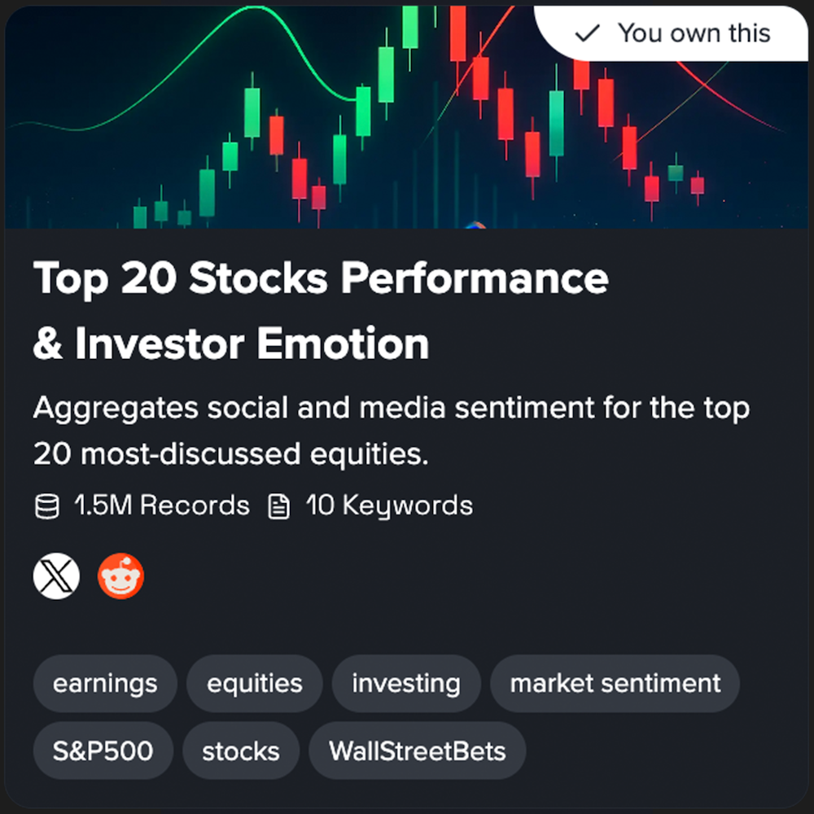

# Data Universe

### **What is** Data Univers&#x65;**?**

In a world where consumer preferences shift overnight, businesses battle to stay relevant— outdated, incomplete data is no longer an option. **Data Universe** is a data collection tool which **solves this problem** by enabling rapid access to fresh, relevant data in real-time.

Data Universe was created to make large-scale social data accessible, affordable, and instantly usable for teams who rely on real-time online conversations. Instead of dealing with unreliable scrapers, constant platform changes, API limitations, or high data-provider costs, users get a single interface that delivers fresh, structured data from major platforms like X, Reddit, and YouTube. Whether the goal is market intelligence, audience research, trend tracking, brand monitoring, or training AI models, Data Universe provides  clean, comprehensive, enriched social content that users can plug directly into their workflows.

Data Universe is available as



<h4 align="center">Data Collection</h4>

<figure><figcaption></figcaption></figure>

<a href="https://app.macrocosmos.ai/gravity/tasks" class="button primary">Sign in</a>




<h4 align="center">Marketplace</h4>

<figure><figcaption></figcaption></figure>

<a href="https://app.macrocosmos.ai/gravity/marketplace" class="button primary">Sign in</a>




<h4 align="center">API</h4>

<figure><figcaption></figcaption></figure>

<a href="https://docs.macrocosmos.ai/developers/readme/installation" class="button secondary">Docs</a>




Explore [Data Universe Use Cases](./#data-universe-use-cases) or stories from our recent collaborations in [Cases Studies](./#case-studies) to see real examples of how teams use Data Universe and the full range of benefits it can deliver.

### Data Universe Use Cases

<table data-card-size="large" data-view="cards"><thead><tr><th></th><th></th><th></th><th data-hidden data-card-cover data-type="image">Cover image</th></tr></thead><tbody><tr><td><h4>How to understand how people feel about my brand?</h4></td><td>Learn how to turn messy online conversations into a heartbeat for your brand, combining social listening, surveys, and simple dashboards to track feelings, fix issues, and amplify what customers love.</td><td><a href="data-universe-use-cases/how-to-understand-how-people-feel-about-my-brand.md">Learn more...</a></td><td><a href="../../.gitbook/assets/9b7597d6-1182-45fd-b66d-da038ee19136.png">9b7597d6-1182-45fd-b66d-da038ee19136.png</a></td></tr><tr><td><h4>What is the best way to find out what topics people connect with my brand and competitors?</h4></td><td>Turn scattered online mentions into a living association map, revealing  where competitors dominate, and which untapped narratives your brand should claim next.</td><td><a href="data-universe-use-cases/what-is-the-best-way-to-find-out-what-topics-people-connect-with-my-brand-and-competitors.md">Learn more...</a></td><td><a href="../../.gitbook/assets/a3ace99b-eb84-46cc-8fe6-a73aec82f0a4.png">a3ace99b-eb84-46cc-8fe6-a73aec82f0a4.png</a></td></tr><tr><td><h4>How can I identify emerging trends in my market before they show up in traditional surveys?</h4></td><td>Turn online conversations into your early-warning radar, spotting weak signals, frustrations and opportunities on X, Reddit and YouTube long before surveys, so you can respond faster and outgo key competitors.</td><td><a href="data-universe-use-cases/how-can-i-identify-emerging-trends-in-my-market-before-they-show-up-in-traditional-surveys.md">Learn more...</a></td><td><a href="../../.gitbook/assets/eccdbf78-64a1-48da-bd8a-2b174fa8fdda.png">eccdbf78-64a1-48da-bd8a-2b174fa8fdda.png</a></td></tr><tr><td><h4>How can I track changes in public perception after a product launch or major campaign?</h4></td><td>Make every launch a learning loop by tracking perception shifts across social channels and reviews, revealing what changed in people’s minds so you can refine messaging and de-risk campaigns.</td><td><a href="data-universe-use-cases/how-can-i-track-changes-in-public-perception-after-a-product-launch-or-major-campaign.md">Learn more...</a></td><td><a href="../../.gitbook/assets/1d3102e0-7432-40ef-a0fa-2c6557c923df.png">1d3102e0-7432-40ef-a0fa-2c6557c923df.png</a></td></tr></tbody></table>

For more use cases >> [Data Universe Use Cases](./#data-universe-use-cases)

### Data Universe Data Collection Demo



### Case Studies

[TAOLOR: Building a subnet-native AI agent with distributed RAG](https://macrocosmosai.substack.com/p/taolor-building-a-subnet-native-ai)

.png>)[Building the future of authentic data: how subnet 111 leverages Macrocosmos' Gravity](https://macrocosmosai.substack.com/p/building-the-future-of-authentic)

 (3).png>)[Global weather, social context: How SN13 is powering SN57's weather data innovation](https://macrocosmosai.substack.com/p/global-weather-social-context-how)

 [Result: SN44, Score, partners with SN13’s Data Universe](https://macrocosmosai.substack.com/p/result-sn44-score-partners-with-sn13s)

 

