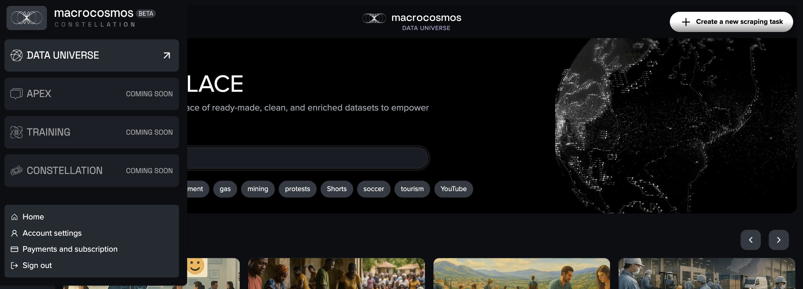

# Data Collection

Navigate to [app.macrocosmos.ai](https://app.macrocosmos.ai/) to access Data Universe.&#x20;

#### Chose between options

* **Search** for any available data from the Marketplace&#x20;
* **Create a new scraping task** for the new customised data collection
* or **Tasks** to see your data library.

<figure><figcaption></figcaption></figure>

#### Use the Macrocosmos icon to navigate the menu

<figure><figcaption></figcaption></figure>

#### **Create a New Task to collect data**

With customised data collection request get only the data that truly matters. Understand audiences with confidence and turn social data into actionable insights for your brand or product.

How it works:

1. Name your task. For example, Top 10 stock assets US.
2. Set your date range.
3. Choose your platforms X (Tweeter), Reddit or YouTube.
4. Add keywords, topics, or Youtube channels.
5. Click **Launch data collection**
6. Receive fresh, structured data collected specifically for your request in hours, or wait for a couple of day to get more data.

You also can use the **AI Assistant** to help you:\
Simply type a topic into your chat with **Mission Commander**, then review the suggested labels, hashtags, and keywords that appear on the right side of the task collection request. You can easily customise them by adding new ones or deleting any that don’t fit.

No complex setup. No scraping headaches. Just fast, precise social data delivered straight to you.

<figure><figcaption></figcaption></figure>

#### Mission Commander

Choosing the right topics for data collection is harder than it looks. Social conversations shift fast, keywords evolve, and each platform has its own language. Miss the right hashtag, subreddit, or phrasing, and you risk collecting irrelevant data or missing the conversations that matter most.&#x20;

Many teams spend hours guessing which keywords to include, testing variations, and manually exploring communities just to ensure their dataset is meaningful.

**Mission Commander** removes that guesswork. As a specialised AI assistant, it automatically suggests high-relevance keywords, trending hashtags on X, the most suitable subreddits on Reddit, and topic-aligned YouTube channels. It  also explains _why_ each choice fits your objective and recommends the best tactics for structuring your query.&#x20;

Whether you're tracking sentiment, analysing competitors, researching trends, or preparing training data, Mission Commander helps you choose smarter topics, faster, ensuring your collection is accurate, comprehensive, and aligned with your real goal.

#### Demo of Mission Commander



**You can also interact with Data Universe through API at** [**docs.macrocosmos.ai**](https://docs.macrocosmos.ai/)**.**

Our pricing plans are available at the [app.macrocosmos.ai](https://app.macrocosmos.ai/) in your account section or on at [datauniverse.macrocosmos.ai](https://datauniverse.macrocosmos.aihttps/datauniverse.macrocosmos.ai/).
