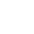
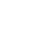

# TAH Support and FAQs



 **Get started**

[Training At Home (TAH) User Guide](tah-user-guide.md)

[Hardware & OS Requirements](hardware-requirements.md)



 **Contact us for support**

[Macrocosmos Discord](https://discord.gg/vRTaAXpRcd)

[Bittensor Discord](https://discord.com/channels/799672011265015819/1162768567821930597)

[Support Email](mailto:support@macrocosmos.ai)



## Getting Started

What is Training at Home? 

Training At Home lets you contribute your computer’s spare power to help train models on the IOTA network. You can participate for free or earn rewards.

<strong>How do I get access to Training At Home (TAH)?</strong>

Fill the form at [iota.macrocosmos.ai/train-at-home](http://iota.macrocosmos.ai/train-at-home). TAH will open to everyone soon and all regions are supported.

<strong>What platforms are supported by TAH?</strong>

MacOS at launch, Linux following soon after. Windows is not on the roadmap yet. For more details have a look at [Hardware & OS Requirements](hardware-requirements.md).

Do i need to create an account? 

No account is required. Your setup is tied to your device and, if you choose to earn rewards, a wallet address.

## Wallets & Rewards

Do i need a wallet to use Training at Home?

No. A wallet is only required if you want to receive rewards. You can train and contribute without one.

I want to earn rewards. What do i need?

To earn rewards you only need one thing:

a Bittensor coldkey address.

A coldkey is simply the address where rewards are sent.

You do not need crypto experience, tokens, or an exchange to start.

What is a Bittensor wallet?

A Bittensor wallet is just where your rewards are sent if you choose to earn money from Training At Home.

Training At Home runs on the Bittensor network, and Bittensor does not use accounts or usernames. Instead, it sends rewards directly to a wallet address, similar to how a bank transfer needs an IBAN.

If you connect a wallet, Training At Home knows where to pay you.

If you don’t connect a wallet, you can still train and contribute, you just won’t receive rewards.

The app only ever uses the coldkey address, which is a public payout address. It never asks for passwords, private keys, or recovery words, and it never has access to your funds or your computer.

In short:

Bittensor wallet = optional payout address for rewards.

<strong>Do I need to connect a Bittensor wallet to use Train at home?</strong>

No. Connecting the wallet is optional. If you'd like to receive rewards paste your public coldkey. Support for popular wallet managers is coming soon. See the [Rewards](rewards.md) page for payout details.

What is a Coldkey?

A coldkey is the address where your rewards are paid.

When you earn rewards in Training At Home, the system needs to know _where to send them_. The coldkey is simply that destination. It works like a bank account number, you can receive money through it, but it does not give anyone permission to spend it.

Training At Home only uses the coldkey to send rewards. It cannot see your balance, move funds, access your wallet, or control your computer. 

You never share passwords, secret words, or private keys.

You only paste the coldkey address, nothing else. 

In short:

Coldkey = safe, read only payout address for rewards.

<strong>How do i setup a Bittensor Coldkey on MacOS?</strong>

#### **Step 1, open Terminal**

1\. Open Finder

2\. Go to Applications

3\. Open Utilities

4\. Click Terminal

#### **Step 2, install Python 3.12**&#x20;

If you already have Python 3.12, skip this.

1\. Go to python.org and install Python 3.12

2\. Restart your computer

3\. In Terminal, check it worked by typing:

`python3.12 --version`\
 

You should see Python 3.12.x.\
\
 

#### **Step 3, create a safe “wallet folder”**

This keeps everything tidy.\
\
Copy and paste:\
`python3.12 -m venv bt-env`\
`source ~/bt-env/bin/activate`\
\
You will see (bt-env) in Terminal. That means it is working.

#### **Step 4, install the wallet tool**

Copy and paste:

`python -m ensurepip --upgrade`\
`python -m pip install --upgrade pip`\
`python -m pip install bittensor bittensor-cli`

If macOS asks to install developer tools, click Install.

If it asks for your Mac password, that is normal.

#### **Step 5, create your wallet**

Copy and paste:

`btcli wallet create` 

It will ask:

• Wallet directory, press Enter

• Wallet name, choose any name, for example AlmasWallet, this is not public

• Coldkey name, type default

**Then it will show you secret words.**

#### **Step 6, write down your secret words**

This is the most important part.

• Write the words down on paper

• Do not screenshot

• Do not store them on your computer

• Do not share them

**The app will never ask for these words.**

\
**Step 7, find your coldkey address**

Copy and paste:\
`btcli wallet list` 

You will see:

• Coldkey address

• Hotkey address

You only need the coldkey address. 

Coldkey looks like a long string, for example:

5EHRFDz... 

**Hotkey looks similar but is not used for payouts.**\
\
Step by step, connect your coldkey in the IOTA app

1\. Open the Training At Home app

2\. Click Connect wallet

3\. Select Specify a Bittensor wallet coldkey for payouts

4\. Paste your coldkey address

5\. Click Connect

6\. Click Start training

That is it.

I cannot install a Coldkey wallet tool, what should i do?

The most common fixes are:

• Install Python 3.12

• Allow macOS developer tools when prompted

• Install OpenSSL if your Mac asks for it

 

If you still get stuck, contact support and include the error text.

Does the app ever need my secret words or password?

No.

If any screen asks you for:

• secret words

• mnemonic

• private key

**Stop. Do not continue. That is not required for Training At Home.**

Do I need an exchange account to earn?

No.

You can earn rewards without an exchange account.

An exchange is only needed later if you want to convert TAO into cash, and availability depends on your region.

Can I change my wallet later?

Yes. You can disconnect or replace your coldkey at any time.

How do I create a wallet if I’m not technical?

We provide a [step by step guide ](faqs.md#how-do-i-setup-a-bittensor-coldkey-on-macos)that walks you through creating a wallet safely on macOS. You only need to do this once.

If you get stuck, you can:

* Ask someone technical to help once
* Or run Training At Home without rewards

## Earnings & Payouts

How are rewards calculated?

Rewards are based on how much useful training work your computer contributes.

This includes:\
• How many tokens your computer processes during training\
• How often your computer sends updates back to the network\
• Additional factors like uptime, reliability, and current network settings

The exact weighting can change over time as the system improves.

How often are rewards paid?

When rewards are active:

* Payouts happen approximately every 24 hours
* This timing may change in the future

Is there a minimum payout?

Yes.

* The minimum payout is 2 ALPHA
* If your balance is below this amount, it rolls over to the next payout
* Network transfer costs are deducted from the amount you receive

Are there taxes or legal requirements?

Yes.

You are responsible for understanding and complying with any local tax or regulatory requirements related to rewards you receive.

Do I need to connect a wallet to earn rewards?

You only need a wallet to receive payouts.\
• If you connect a wallet, rewards are sent to your coldkey\
• If you don’t connect a wallet, training still runs but rewards are not paid

Rewards earned while no wallet is connected are not paid retroactively.

Where can I see my earnings?

In the app:

1. Click the Miner button in the top left
2. View your current earnings and contribution stats

Why do my earnings show 0?

Common reasons:

* Rewards are not active during beta
* Training has just started
* You haven’t reached the minimum payout yet
* No wallet is connected

This is normal and does not mean something is broken.

## Training & Usage

What does “Start training” do?

When you click Start training, your computer connects to the network and begins receiving small training tasks. It uses a portion of your computer’s resources to process those tasks and sends the results back to the network.

Until you click Start training, the app is idle and does not use your computer.

Once training starts, your contribution and activity will appear in the app.

You can stop training at any time, and nothing continues running in the background when training is stopped.

Why does my contribution change over time?

Your contribution is not a fixed score. It changes because the network is shared with many other people. 

As others join or leave, as training phases change, or if your computer or internet speed changes, your contribution number can go up or down. This is normal and does not mean something is wrong.

Can i pause or stop training?

Yes. You are always in control. You can stop training at any time, and your computer will immediately stop doing training work.

What happens if I close the app, restart my computer, or my laptop sleeps?

Training stops automatically. Nothing continues running when the app is closed or your computer goes to sleep. When you open the app again, you can start training again.

## Hardware & internet

What hardware do i need?

Most modern computers can participate. More powerful computers usually contribute more, but you do not need special hardware to get started.\
\
A minimum of 16 GB RAM is recommended. More capable hardware generally contributes more, but you can still participate without having the best setup.

If your device struggles, you can still help by training for shorter sessions

Will this slow down my computer?

It can, depending on what else you are doing.

Training uses compute resources, so you may notice:\
• Slower performance when multitasking\
• Higher fan activity\
• Faster battery drain if unplugged

If you need full performance for work, you can pause training temporarily.

Will this overheat or damage my computer?

It should not damage your computer.

Your device has built in safety controls, and you can always stop training if it feels too warm or loud. If you notice persistent high heat, reduce usage by running fewer other apps while training, improve airflow, or train in shorter sessions.

How important is my internet connection?

A stable internet connection helps your computer stay connected to the network and send results back. If your connection drops often, your contribution may be lower, which is normal.

Can I stop using Training At Home whenever I want?

Yes. You can stop training or uninstall the app at any time. There are no penalties or commitments.

<strong>How can I improve performance/heat?</strong>

Keep the machine plugged in, use a cooling pad/stand, and close heavy GPU/CPU apps. You can pause anytime by toggling **Start training** off.

<strong>What hardware do I need to contribute to TAH?</strong>

16 GB RAM minimum; M‑class chips recommended but not required. See [Hardware & OS Requirements](hardware-requirements.md) for full specification.

## Privacy & Security

Can the app access my files or personal data?

No. The app does not read your files, see your screen, or monitor what you do. It only runs training tasks and sends technical results back to the network.

<strong>What data do you store?</strong> 

We store your public coldkey to pay you, and may store location and hardware metadata to allocate runs and monitor performance. Some training artifacts are stored locally on your machine.

## Updates

<strong>How do updates work?</strong>

The app auto-updates on startup or prompts when an update is available. Staying current is essential to avoid errors or security issues.

