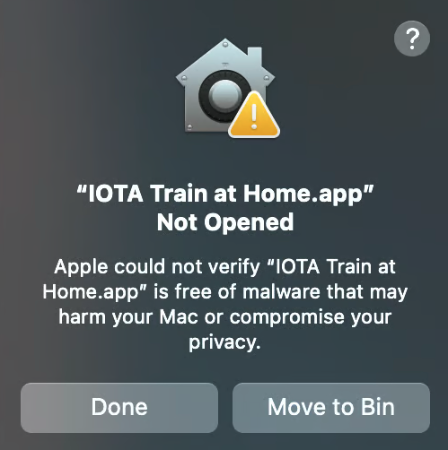

# TAH User Guide

Training at Home (TAH) application (app) allows you to connect and partake in our decentralized AI training platform [IOTA](../../subnets/subnet-9-iota/). You can plug in any hardware you have access to and earn rewards for powering decentralized AI model training.&#x20;

We aim to solve one of the biggest challenges in open-source AI today: the absence of a decentralized, community-driven, and highly efficient pre-training platform.&#x20;

Today, access to large-scale compute is concentrated in a few organizations, limiting innovation and slowing progress across the ecosystem. By enabling anyone to contribute hardware and collectively train powerful models, we lower the barrier to participation, unlock underutilized global compute, and empower a wider community of builders and researchers. This creates a more resilient, transparent, and scalable foundation for advancing open-source AI — one that grows stronger as more people join and contribute.

## Installation

There's currently a [shortlist](https://iota.macrocosmos.ai/train-at-home) to use TAH as we will slowly be scaling the system and rolling the app out to more and more users. We also currently only support MacOS, with Linux support coming soon. If you already have access you should've received a `.dmg` file, you can double click it to install the app. We are still working on getting notarization from Apple so after opening the installed app you will be prompted with the warning "Apple could not verify "IOTA Train at Home.app" is free of malware that may harm your Mac or compromise your privacy.

<figure><figcaption></figcaption></figure>

You'll have to follow the steps in the video below

{% embed url="https://files.gitbook.com/v0/b/gitbook-x-prod.appspot.com/o/spaces%2FJDlWdmSC3GnzBPSkAiBM%2Fuploads%2FnxT5vvIvbkghk58drv46%2FTAH-security-workaround.mp4?alt=media&token=80315f68-e7f1-4d0d-869f-58fca6c64287" %}

Or if you can't open the video: Apple logo in the top left -> System Settings -> Privacy & Security, then you'll see this: .png>)

Click on "Open Anyway" and the app should open correctly

### First Launch

Once the app is installed you should be able to see the main dashboard:

<figure><figcaption></figcaption></figure>

You should see metrics related to your specific model and in the center there should be a visualization showing you the other training participants.

## Next steps

* [Operating TAH](operating-tah.md) — start/pause training, connect wallet, and monitor runs.
