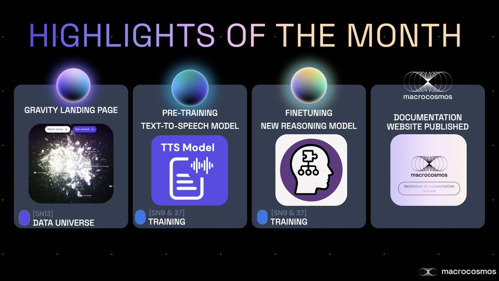

# Subnet Status Update

[2025-03-31 Macrocosmos Subnets Status Updates Q1 2025](https://docs.google.com/presentation/d/1XOP41h56v9PXNnz7KbcQdrtpw9KUY1SFLujU36fUgfc/edit?slide=id.p#slide=id.p)

<figure><figcaption></figcaption></figure>

***

[2025-02-28 Macrocosmos Subnets Status Updates Q1 2025](https://docs.google.com/presentation/d/1Gd7H1PHDC8btj75MLCumA8kBR_4iqWOVHlhUuDu6tUY/edit#slide=id.g339c6890a7f_0_0)&#x20;

<figure><figcaption></figcaption></figure>

***

[2025-01-16 Macrocosmos Subnets Status Updates Q1 2025](https://docs.google.com/presentation/d/1umqf1oipAmf88ntiTXch__ipV-yU24Ew/edit#slide=id.p3)

<figure><figcaption></figcaption></figure>

***

[2025-01-12 Macrocosmos Subnets Status Updates Q4 2025](https://docs.google.com/presentation/d/1_Cm893qgsTDGuwxsDC_KzuJi6iGbOjmD/edit#slide=id.p3)

<figure><figcaption></figcaption></figure>

***

[2025-11-01 Macrocosmos Subnets Status Updates Q4 2025](https://docs.google.com/presentation/d/1X4f6W5HiMmKIN2Lq3HjqEEzkU_SM8r22/edit#slide=id.p3)

<figure><figcaption></figcaption></figure>

***

[2025-10-07 Macrocosmos Subnets Status Updates Q4 2025](https://docs.google.com/presentation/d/1aNI7-zqVkiV2DWkggjF6R58TCmouFSYznCH7q5wq9oM/edit#slide=id.g22023d6a893_1_59)

<figure><figcaption></figcaption></figure>

***

[2025-09-11 Macrocosmos Subnets Status Updates Q4 2025](https://docs.google.com/presentation/d/1khSTwJUxgxADM3Me0NEQ1M09io1NnbIO/edit#slide=id.p3)

<figure><figcaption></figcaption></figure>

***

