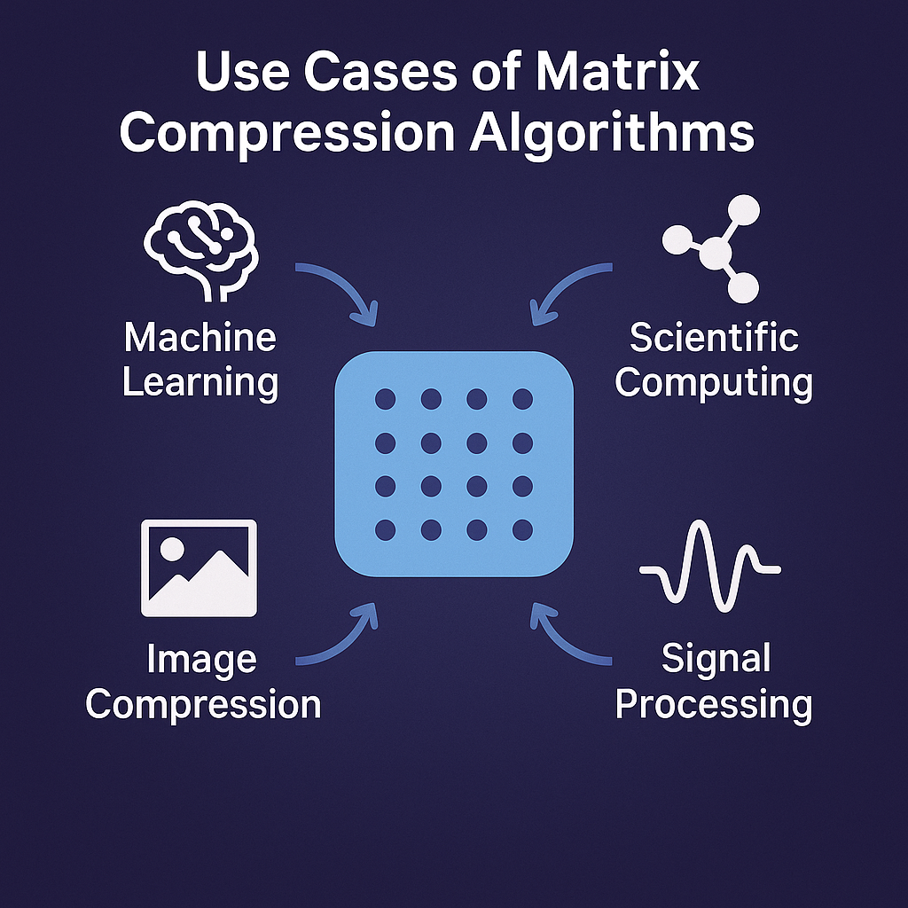

# New Subnet 1 Apex

## Introduction

Decentralised intelligence offers a powerful new way to approach complex algorithmic and agentic optimisation problems by leveraging the collective reasoning and computational capacity of distributed networks. Through collaboration among independent nodes, such systems can generate solutions for complex mathematical and algorithmic problems that were once too large or intricate for any single entity to handle.

<figure><figcaption></figcaption></figure>

Advanced algorithmic and agentic systems focus on solving independent tasks, addressing bottlenecks, and optimising processes across all levels of complexity. The true value of this approach lies not only in solving abstract equations or algorithms but in translating those solutions into real-world impact. It can help humanity make better data-driven decisions improving areas such as&#x20;

* Finance
* Infrastructure
* Social networks
* Biology
* and other.

### Compression of activations challenge 

The first major milestone to tackle is the compression of activations, a challenge that lies at the heart of efficient distributed intelligence. By solving this problem we can enable **network load optimisation**: significantly reduce communication and memory overhead during large-scale training or inference, enabling smoother collaboration between decentralised nodes and faster model optimisation.

**Why activation compression matters so much in decentralized LLM training:**

1. Activations must be communicated or stored between layers/devices. Without compression, this inter-layer communication becomes the major bottleneck in throughput and scalability.
2. Activation compression enables effective scalability across many nodes by mitigating network communication latencies. 
3. Reduced the memory footprint of activations, frees up resources for other parts of the pipeline — thus improving the overall efficiency and cost-effectiveness of decentralized training.

Successful solution of compression of activations also unlocks several high-impact real-world applications:

* Distributed AI and Federated Learning Efficiency
* Data Center and Cloud Infrastructure Optimisation
* Edge and Networked Systems Performance
* Large-Scale Simulation and Optimisation Systems

The advancements of applying the optimisation translate into Lower network strain in AI-driven systems, more sustainable infrastructure, faster, scalable collaboration between machines and data centres, real-time optimisation for logistics, transportation, and communication networks.

### Subnet 9 IOTA Use Case 

When the Subnet 1 Compression of activations competition results in successful solutions, **Subnet 9 IOTA stands to gain significant benefits** in both performance and scalability. Efficient compression techniques will drastically reduce communication overhead between nodes, allowing faster and more synchronised training across the decentralised network. This improvement not only enhances computational throughput but also lowers the energy and bandwidth requirements for participating validators, making the subnet more sustainable and cost-efficient.

Additionally, successful solutions will strengthen IOTA’s position as a leader in decentralised intelligence by enabling smoother interoperability between AI agents and facilitating more complex, real-time collaboration.

Ultimately, this advancement will improve the overall robustness, accessibility, and competitiveness of Subnet 9 IOTA and Subnet 1 Apex within the broader Bittensor ecosystem.

### Open source approach 

Open-sourcing such a solution amplifies its global benefits allowing developers, researchers, and industries to build upon a shared foundation, accelerate innovation, and ensure transparency and accessibility. This open collaboration not only democratises advanced computation but also strengthens real-world infrastructure by making intelligent, resource-efficient systems available to all.

### Introduction Summary 

By bridging theoretical problem-solving with practical applications, decentralised intelligence enables more transparent, efficient, and equitable solutions to some of society’s most pressing challenges.

Subnet 1 has the potential to address an immense range of use cases, spanning from micro-level algorithmic optimisations to large-scale, multi-agent system coordination. Its decentralised and adaptive architecture enables it to tackle problems in domains such as logistics, infrastructure, finance, and autonomous systems with high efficiency. As an algorithmic and agentic optimisation solver, Subnet 1 can scale to meet the computational demands of both individual applications and global networks, unlocking transformative real-world solutions.

### What is next 

Apex subnet is set to unlock innovation at scale by hosting multiple competitions at once, empowering the community to solve several challenges in parallel. This multi-competition model transforms the subnet into a vibrant hub of creativity and collaboration, where diverse minds can contribute breakthrough ideas from different fields simultaneously. By dividing miner emissions across dedicated competition pools, Apex ensures that every area of exploration receives the support it needs — fueling a constant flow of progress and discovery. It’s a system designed not just for efficiency, but for exponential growth.

<figure><figcaption></figcaption></figure>

Running several competitions in parallel will allow the subnet to dramatically scale its impact across the Bittensor ecosystem and beyond. Each competition acts as a catalyst for real-world innovation — from advancing AI infrastructure to optimizing global technologies. Together, they create a self-sustaining cycle of challenge, reward, and improvement that accelerates humanity’s collective problem-solving power. Through this bold approach, Apex is shaping a future where decentralised intelligence doesn’t just evolve – it thrives.
