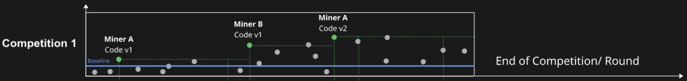
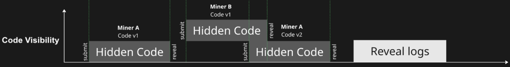
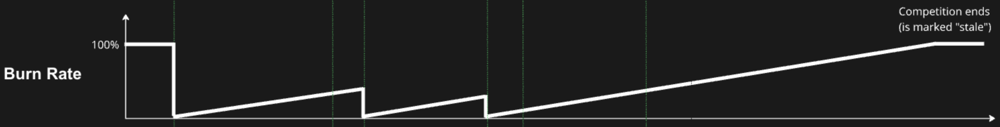

# Incentive Mechanism

The core idea behind the subnet is to share problem-solving code openly, so researchers and developers everywhere can use it. By making these solutions accessible to all, the subnet’s work can have a wider impact and help tackle real-world challenges.

For example, in the Matrix Compression competition — the first event on the subnet — the winning solution will not only directly enhance Subnet 9’s output but could also contribute to optimising data centres and cloud infrastructure, which are crucial in the AI era.

### General Operation 

Short description of the subnet’s general operation:

* **Solution Submission**\
  Miners submit their solutions to the competition to the submission endpoint API.
* **Execution and Metrics**\
  Each solution runs inside an isolated secure sandbox, generating its evaluation metrics.
* **Evaluation**\
  The subnet validator reviews these metrics and assigns a score to each submitted solution.
* **Scoring and Selection**\
  Validators retrieve the scores from the subnet orchestrator to determine the winning miner.
* **Rewards**\
  The miner with the highest score receives the full reward. If that solution is replaced or improved, the next best submission takes over and earns the rewards of the competition.

<figure><figcaption></figcaption></figure>

### Incentive Challenges 

Opening the code approach creates several challenges for the subnet to solve:

#### 1. How to ensure that the successful solution code submitted by one miner is not used be other miner to steal the reward? 

To ensure miners are fairly rewarded for their best solutions, the submitted code remains hidden for a set period. Once evaluation is complete and rewards are distributed, the code is made public for others to explore.

<figure><figcaption></figcaption></figure>

The winner’s code is revealed with a delay. Duration of the hidden code period depends on the competition and will be set for 2-5 days.

This approach guarantees creators to fully exercise the submission rewards, while still allowing others to learn from and improve existing solutions — tapping into the power of community innovation.

Logs are published only after the completion of a competition round. So, that a participants could improve their performance strategy.

<figure><figcaption></figcaption></figure>

#### 2. How to motivate miners for continuous improvement? 

To encourage successful miners to keep improving their code, the subnet team introduced an emission burn mechanism. Once a top-performing solution is submitted, its associated emissions gradually start to burn. The longer the solution remains unchallenged, the higher the burn rate becomes — motivating continuous innovation and competition.

<figure><figcaption></figcaption></figure>

#### 3. What will be the baseline and success metrics of the Matrix Compression competition? 

The initial baseline for the Matrix Compression challenge will be the Lempel–Ziv–Markov-Chain Algorithm (LZMA). LZMA, recognizable in due to its frequent usage in 7-zip, combines dictionary and range encoding, saving bits on repeated data and predictable byte sequences. We adopt the implementation from the standard python library. Improving upon, or beating this algorithm, will result in being rewarded via the incentive mechanism.

#### 4. How to ensure fair and safe validation of someones code, which can not be public until the validation is complete? 

To ensure secure and safe validation process and still leave the process of validation decentralised, the subnet is using the Code Executor.

The Code Executor is a part of the subnet where miners code runs in order to demonstrate working solution and provide solutions metrics. Metrics depend on the type of the competition. In case of the Matrix Compression competition such metrics are:

* Compression ratio - the max level of compression provided by solution
* Compression speed - the time required to run a compression and decompression processes
* De-compression accuracy - similarity between the input and output of compression - decompression process.

After solution run in the Code Executor, metrics are converted into score in accordance with incentive mechanism. Scores are stored and provided to Validators by request, enabling rewards distribution mechanism.

### Summary of Incentive Challenges 

The subnet is designed to share open-source problem-solving code, enabling researchers and developers worldwide to collaborate and create real-world impact. Its operation centres around competitions, where miners submit solutions to achieve the best performance metrics and earn rewards. To ensure fairness and continuous innovation, the subnet uses mechanisms such as temporary code hiding, emission burn incentives, and secure code execution during validation.

Combined diagram below demonstrates the process timeline and plain principles of the subnet incentive mechanism:

<figure><figcaption></figcaption></figure>
