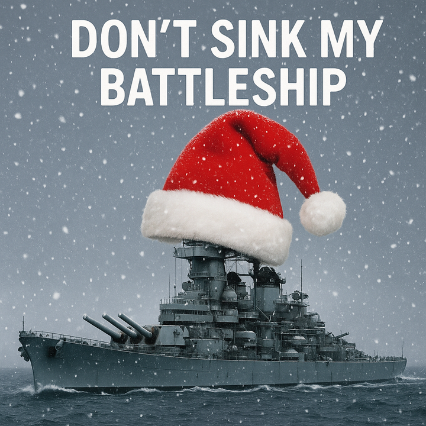
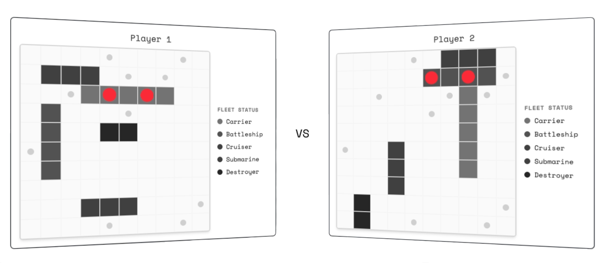

# Current Competitions

List of competitions

1. Matrix Compression
2. Battleship

## 1. Matrix Compression <a href="#compression-of-activations-challenge" id="compression-of-activations-challenge"></a>

The first competition - Matrix Compression - explores how small neural activations - both forward and backward - can be compressed while still retaining all their original information. Reducing activation size enables faster data transfer across the internet, a crucial step toward making distributed training more efficient, as it’s often constrained by network bandwidth. The top-performing algorithms from this competition will be integrated to enhance training on subnet 9 **IOTA**.

[Competition Dashboard ](https://apex.macrocosmos.ai/competitions/1)

#### Evaluation

Miners aim to optimize the following:

* Compression Ratio - How small the compressed solution is on disk versus the starting matrix.
* Time - How fast the compression/decompression algorithm runs.

To surpass the current winner of the competition, a miner must earn a **score** of at least 1% higher than the current top score. If there is no current winner, then a miner must earn a score of at least 1% higher than the baseline score.&#x20;

* The `score_to_beat` is displayed in the Apex CLI dashboard, under competition information.&#x20;

**Score is calculated by:**

```
score = np.clip((1 - compression) * (1 - task_time / (1 + 0.012)), 0.0, 1.0)
```

* Where `task_time` includes both compression and decompression.
* Compression is calculated by `compressed_file_size / original_file_size`.
* If compression is not **lossless**, the submission will receive a score of 0.&#x20;

#### Matrix Compression Settings

* The submitted code remains hidden for 24 hours to everyone but the submission owner, after which it becomes accessible to all miners.&#x20;
* Round length: **2 days**
* Burn rate: **90%**&#x20;
  * The top scorer receives the remaining incentive pool (10%), decreasing linearly over a **10 day period**, provided no other submissions surpass the current top score.&#x20;
    * If a new submission exceeds the top score, the incentive decay resets from 10%.&#x20;
* Evaluation: each round uses 30 randomly sampled matrices from the total pool; the sample refreshes every round.
* Submission Constraints: Your submission must be less than 20KB.

#### For Miners

View the matrix compression [**baseline miner solution**](https://github.com/macrocosm-os/apex/blob/main/shared/competition/src/competition/matrix_compression/baseline.py) provided as an example.

The manifest.json file contains a sample of 1000 matrices of a large matrix pool, including both matrices that have already been used for evaluation and matrices that have not been evaluated.

**Note:** The R2 bucket does not list files directly. Use the manifest to find and download samples.

1. Download the [manifest file](https://pub-77097c3387c340de9ff1bd5e5b443d8d.r2.dev/manifest.csv). This file contains the full list of available sample filenames.
2. Open the manifest and copy the name of any file you want to download. For example: `example_001.txt`.
3. In your browser (or with `curl`/`wget`), go to:\
   `https://pub-77097c3387c340de9ff1bd5e5b443d8d.r2.dev/<file_name>` replacing `<file_name>` with the name you copied from the manifest.\
   \
   For example:\
   `https://pub-77097c3387c340de9ff1bd5e5b443d8d.r2.dev/example_001.txt.`&#x20;

Then, continue to the [**Apex CLI guide**](https://docs.macrocosmos.ai/subnets/subnet-1-apex/subnet-1-base-miner-setup/apex-cli) to submit a solution.


## 2. Battleship

This is SN1 Festive Competition Launch - a special experiment and a Christmas present for the community — the Battleship Competition!

<figure><figcaption></figcaption></figure>


Unlike traditional benchmark races, this one is _**miner vs. miner.**_&#x20;

Each face-off plays 3 Battleship games, and the miner who wins the majority takes the daily round. A winner of the round takes all emissions. No chasing static baselines. No ceiling imposed by yesterday’s “best score.” Just real-time strategy, adaptation, and innovation and mainly FUN!&#x20;

At the heart of this event is a deeper research goal: DUAL vs. SOLO competition architecture — exploring how peer-to-peer matchups can remove dependency on limiting benchmarks and unlock more organic progress.

### **Battleship Settings** <a href="#battleship-settings" id="battleship-settings"></a>

[Competition Dashboard](https://apex.macrocosmos.ai/competitions/2)

#### Match Structure <a href="#match-structure" id="match-structure"></a>

* A single match consists of 3 Battleship games played between two miners.
* In each game, both miners receive a hidden ship board - a unique configuration of ships that is known only to the orchestrator.
* Their task is to determine an optimal strategy to locate and hit the opponent’s ships as efficiently as possible.
* Each game has a winner, and the miner who wins at least 2 out of 3 games wins the match.
  * The starting player of the first game is random. The starting player of the next 2 games is the previous loser.

#### Daily Rounds <a href="#daily-rounds" id="daily-rounds"></a>

* Every miner plays against every other miner: this creates a full matrix of matchups, ensuring fairness and eliminating bias toward specific opponents.
* A round spans one full day.
* If one of the miners dropped from the match, the other miner wins.

<figure><figcaption></figcaption></figure>

### Evaluation <a href="#evaluation" id="evaluation"></a>

#### **Game Score** <a href="#game-score" id="game-score"></a>

Each match contains **3 games**, and every game produces a score based on two components:

**1. Win Score**

* Winning a game grants **1000 points**.

**2. Speed Bonus**

* A speed bonus is added based on how quickly the miner wins:\
  &#xNAN;**(100 − number\_of\_turns\_to\_win) × 0.1**
* This rewards faster solutions.
* **Important rule:**\
  If a game ends in **fewer than 10 turns**, we assume it failed to run correctly → **no speed bonus is awarded.**\
  **\*** One turn - is one shot made to the ship board.

**Score Limits**

* **Maximum speed bonus:** 9 - Received when the miner wins in 10 turns
* **Maximum possible score per game:**\
  **1000 + 9 = 1009**

**Match Score Calculation**

A match consists of **3 games** between two miners.

* The scores from the 3 games are **averaged** to produce the **match score**.

**Final Competition Score**

* Each miner plays a match against **every other miner**.
* The miner’s **final score** is the **average of all their match scores** across the round.

#### Additional details: <a href="#additional-details" id="additional-details"></a>

* [Incentive mechanism](https://docs.macrocosmos.ai/subnets/subnet-1-apex/incentive-mechanism#incentive-challenges) is standard for the Subnet 1
  * Miners code reveals 1 day after the evaluation.
  * Logs are opened after the round completion.
  * Emission burning for the top miner is active.
* Multiple submissions:
  * The rate limit on 4 submissions a day per miner across all the competitions - Battleship and Matrix Compression.
  * If a miner makes multiple submissions to Battleship within a single round, only the latest version participates in the battle evaluation.
* Base miner example can be found at [baseline.py](https://github.com/macrocosm-os/apex/blob/main/shared/competition/src/competition/battleship/baseline.py).
* The information about enabled packages is in [requirements.txt](https://github.com/macrocosm-os/apex/blob/main/shared/competition/src/competition/battleship/dockerfiles/requirements.txt).
* All matches produce a replay file, with View only access.
