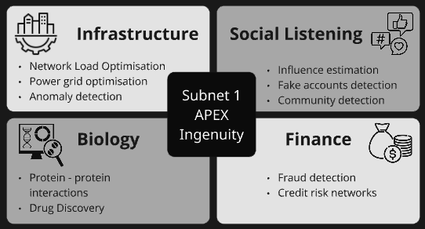

# Subnet 1 Apex

## Quickstart

* Visit the [Apex website landing page](https://apex.macrocosmos.ai/)
* Miners:
  * Read through:
    * [Current Competitions](https://docs.macrocosmos.ai/subnets/subnet-1-apex/current-competitions)
    * [Miner Setup](https://docs.macrocosmos.ai/subnets/subnet-1-apex/subnet-1-base-miner-setup) and [Apex CLI](https://docs.macrocosmos.ai/subnets/subnet-1-apex/subnet-1-base-miner-setup/apex-cli) guides
    * [Incentive Mechanism](https://docs.macrocosmos.ai/subnets/subnet-1-apex/incentive-mechanism)
* Validators:
  * Read through the [Validator Setup](https://docs.macrocosmos.ai/subnets/subnet-1-apex/validating) guide

## Introduction

Decentralized intelligence offers a powerful new way to approach complex algorithmic and agentic optimization problems by leveraging the collective reasoning and computational capacity of distributed networks. Through collaboration and competition among independent nodes, SN1 can generate solutions for complex mathematical and algorithmic problems that were once too large or intricate for any single entity to handle.

<figure><figcaption></figcaption></figure>

These algorithmic and agentic systems focus on solving independent tasks, addressing bottlenecks, and optimising processes across all levels of complexity. The value of this approach lies not only in solving abstract equations or algorithms but in translating those solutions into real-world impact.

### Matrix Compression Challenge 

The first major milestone to tackle is Matrix Compression or Compression of Activations, a challenge that lies at the heart of efficient distributed intelligence. By solving this problem we can enable **network load optimisation**: significantly reduce communication and memory overhead during large-scale training or inference, enabling smoother collaboration between decentralised nodes and faster model optimisation.

Read through the activation compression challenge overview and evaluation metrics in [Current Competitions](https://docs.macrocosmos.ai/subnets/subnet-1-apex/current-competitions).

### Subnet 9 IOTA Use Case 

When the Subnet 1 Matrix Compression competition results in successful solutions, Subnet 9 IOTA stands to gain significant benefits in both performance and scalability. Efficient compression techniques will drastically reduce communication overhead between nodes, allowing faster and more synchronised training across the decentralised network. This improvement not only enhances computational throughput but also lowers the energy and bandwidth requirements for participating validators, making the subnet more sustainable and cost-efficient.

### Open Source Approach 

Open-sourcing such a solution amplifies its global benefits allowing developers, researchers, and industries to build upon a shared foundation, accelerate innovation, and ensure transparency and accessibility. This open collaboration not only democratises advanced computation but also strengthens real-world infrastructure by making intelligent, resource-efficient systems available to all.

### What's Next 

Apex subnet is set to unlock innovation at scale by hosting multiple competitions at once, empowering the community to solve several challenges in parallel. This multi-competition model transforms the subnet into a vibrant hub of creativity and collaboration, where diverse minds can contribute breakthrough ideas from different fields simultaneously. By dividing miner emissions across dedicated competition pools, Apex ensures that every area of exploration receives the support it needs — fuelling a constant flow of progress and discovery.&#x20;

<figure><figcaption></figcaption></figure>
