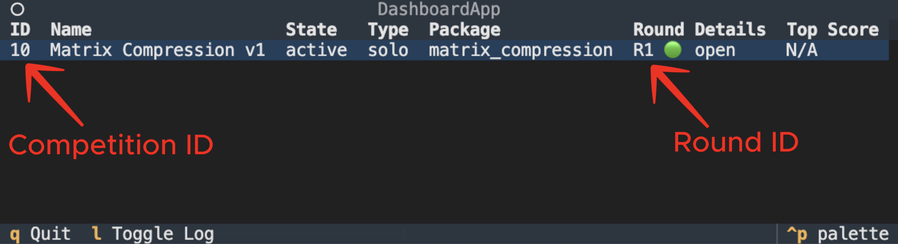

# Apex CLI

The Apex CLI is a miner's interface with the subnet: linking wallets, submitting competition solutions, and viewing the dashboard. The dashboard contains all miner submissions to past and current competitions - use it to view others' code submissions and logs to compare your individual performance against the subnet.&#x20;

To use the CLI you must have a [registered wallet on subnet 1.](https://docs.learnbittensor.org/miners#miner-registration)&#x20;

### Setup

Before using the Apex CLI, make sure you have ran `./setup.sh`. For further instructions, see the [mining docs](https://docs.macrocosmos.ai/subnets/subnet-1-apex/subnet-1-base-miner-setup).&#x20;

* Make sure you have activated your `.venv` prior to using the CLI.
  * `source .venv/bin/activate`

### Link Wallet

Link your registered wallet with the CLI - required for most CLI commands:

`apex link`&#x20;

This will prompt you to enter your Bittensor wallet location, which defaults to the default Bittensor wallet path: `/Users/{USERNAME}/.bittensor/wallets` .

* To select the default wallet location, press _ENTER/RETURN_.&#x20;
* For custom wallet locations, enter the path from the root directory.

Then, use the arrow keys to select your registered coldkey and hotkey from the list provided.&#x20;

NOTE: Some previously created wallets using earlier versions of btcli may not a have a private key configured. If this is the case, regenerate this hotkey before linking.&#x20;

### View Competitions

#### To view the currently active competition:

`apex competitions`

This will return a list of all active competitions and their associated competition IDs.&#x20;

#### To view competitions and their status in detail:

`apex dashboard`

Example Output:

<figure><figcaption></figcaption></figure>

Competition ID 10, Round ID 1.

### View Submissions

To view a submission, first open the dashboard `apex dashboard` and press _ENTER/RETU&#x52;_&#x4E; when hovering the competition of interest.

<figure><figcaption></figcaption></figure>

Your own submissions will be viewable immediately, other's submissions will be viewable after a delay.&#x20;

### Submit a Solution

`apex submit`

This will prompt you to enter the file path to your solution, competition ID, and round ID consecutively.&#x20;

Or, in one line:&#x20;

```
apex submit <Path_To_Solution> -c <Competition_ID> -r <Round_ID>
```

* View the current \<Competition\_ID> and \<Round\_ID> via the dashboard.
* Submissions are limited to **once per hour, per hotkey**.

