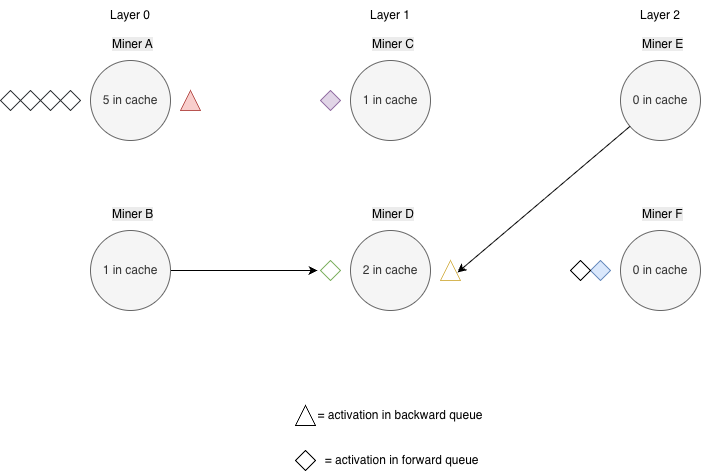

# iota Simulator Competition

The `iota` Simulator models a distributed compute network where activations flow through layers of miners. Miners submit routing and load-balancing algorithms to guide activations through the network as fast as possible. The top-performing algorithms from this competition will be considered for use in subnet 9 `iota`'s orchestration layer.

### Simulator Details <a href="#evaluation" id="evaluation"></a>

A detailed simulator, submission, and log file description can be found in the **info doc** within the [iota\_simulator folder](https://github.com/macrocosm-os/apex/tree/main/shared/competition/src/competition/iota_simulator). The simulator code is currently **proprietary**.

* 96 simulated miners (by default, number may change from round to round) are distributed across layers in a simulated network with bandwidth, latency, queuing, and caching.
* Each activation travels forward through layers 0→N-1, then backward N-1→0.
  * An activation completes when it has finished all forward and backward passes, ending back at layer 0.
  * If an activation takes too long to complete, it will become stale and is dropped, removing it from all applicable caches.
  * The default timeout for staleness is 60 simulated seconds.
* Miners have forward and backward queues.
  * Processing backward activations take priority over forward activations.
* Miners cache activations after forward processing; cache pressure can stall forward queues
  * A miner, by default, has a cache size of 5, meaning it can hold space for up to 5 in-flight activations at a time.
  * An activation is added to a simulated miner's cache after it has been forward-processed.
  * An activation is removed from a simulated miner's cache after it has been backward-processed.
* An epoch completes when 500 activations (by default) finish their full round-trip.
* Between epochs, a merge phase occurs: queues clear, your `/balance-orchestrator` is called, and miner properties may drift slightly.
* All time is simulated — HTTP latency to your server does not count toward your score.
* Simulated miners may have different drop out and rejoin probabilities, bandwidth, latency, etc.

#### **Simulator Diagram Examples - Queues and Caches** <a href="#game-score" id="game-score"></a>

NOTE:&#x20;

* These images don't reflect actual time steps and are just to illustrate the general sequence of events for specific activations and nodes.  In the actual simulation, all nodes are active.
* During the simulation, different nodes may process activations at different rates. Some may drop out unexpectedly, some may rejoin, and some have slower latency and bandwidths than other nodes.&#x20;

<details>

<summary>Example 1:        2 Layers, 2 Miners</summary>

In this example, 1 activation is routed between 2 miners in 2 layers from start to finish.

<figure><figcaption><p>Miner A in Layer 0 receives the red activation in the forward queue. </p></figcaption></figure>

<figure><figcaption><p>Miner A in Layer 0 is processing the red forward activation.</p></figcaption></figure>

<figure><figcaption><p>Miner A in Layer 0 has finished processing the forward activation and passes it to Miner B in Layer 1. Miner A's cache is increased by 1.</p></figcaption></figure>

<figure><figcaption><p>Miner B in Layer 1 is processing the forward activation.</p></figcaption></figure>

<figure><figcaption><p>Miner B in Layer 1 has finished processing the forward activation, and it moves to its backward queue, as Layer 1 is the final layer. Miner B's cache increments after the forward activation has finished processing.</p></figcaption></figure>

<figure><figcaption><p>Miner B in Layer 1 is processing the backward activation.</p></figcaption></figure>

<figure><figcaption><p>Miner B in Layer 1 has finished processing the backward activation and sends it back to Miner A at Layer 0, from whom it received the activation. The activation joins Miner A's backward queue.</p></figcaption></figure>

<figure><figcaption><p>Miner A in Layer 1 is processing the backward activation.</p></figcaption></figure>

<figure><figcaption><p>Miner A in Layer 1 has finished processing the backward activation, and its cache is then decreased by 1. The activation has completed. </p></figcaption></figure>


</details>

<details>

<summary>Example 2:       3 Layers, 6 Miners</summary>

In this example, we follow activations within an in-progress network.&#x20;

<figure><figcaption></figcaption></figure>

In this image:

* Miner A in Layer 0 just received the red backward activation from miner C in Layer 1. Miner C's cache was decreased from 2 to 1.
  * Note: Miner A in layer 0 cannot process any more forward activations until it has finished processing the backward activation in its queue, because its cache is full (at 5).
* Miner B in Layer 0 is processing the green forward activation.
* Miner E in Layer 2 is currently processing the yellow backward activation.
* Miner F in Layer 2 is currently processing the blue forward activation.


<figure><figcaption></figcaption></figure>

In this image:

* Miner A in Layer 0 is currently processing the red backward activation.
* Miner B in Layer 0 finished processing the green forward activation. Its cache is increased by 1, and it sends the activation to the Miner D's forward queue in Layer 1.
* At the same time, Miner E in Layer 2 finished processing the yellow backward activation. Its cache is decreased by 1, and it and sends the activation to Miner D's backward queue in Layer 1.
* Miner C in Layer 1 is currently processing the purple forward activation.
* Miner F in Layer 2 is continues processing the blue forward activation.


<figure><figcaption></figcaption></figure>

In this image:&#x20;

* Miner A in Layer 0 finished processing the red backward activation. Its cache is decreased by 1 and the activation is completed.&#x20;
  * The forward queue is no longer stalled - this node can process 1 more forward activation from the queue before its cache is filled again.
* Miner C in Layer 1 is still processing the purple forward activation.
* Miner D in Layer 1 is currently processing the yellow backward activation.&#x20;
  * The backward activation was prioritized over the forward activation, and thus processed first.&#x20;
* Miner F in Layer 2 has finished processing the blue forward activation, and has added the activation to its backward queue.&#x20;


</details>

### Evaluation <a href="#evaluation" id="evaluation"></a>

Miners implement an HTTP server with two endpoints — `/route` and `/balance-orchestrator` — that control how activations are routed through a multi-layer miner network. Each evaluation task runs a simulation, each with a different random seed and number of layers (3-8) simulating 5 epochs of 500 activations traversing the network forward and backward through all layers.

* `/route` is called once per activation routing decision.
  * 0.5 second timeout per call.
* `/balance-orchestrator` is called once per epoch, between epochs.
  * 0.5 second timeout per call.


An example of a submission implementing **random** routing and balancing can be found in the [iota simulator folder](https://github.com/macrocosm-os/apex/tree/main/shared/competition/src/competition/iota_simulator).


#### **Scoring** <a href="#game-score" id="game-score"></a>

Score is calculated by:

```
task_score = clamp(1 - (total_epoch_time / max_epoch_time), 0.0, 1.0)
final_score = median(task_scores)  # median across 5 tasks
```

* total\_epoch\_time: sum of all epoch durations (simulated seconds), excluding merge phases.
* max\_epoch\_time: analytically computed time ceiling with a safety multiplier.
* To surpass the current winner, a miner must earn a raw score at least 1% higher than the current top raw score. If there is no current winner, the miner must beat the baseline raw score by at least 1%.
* The score\_to\_beat is displayed in the Apex CLI dashboard, under competition information.

#### Miner Submissions <a href="#additional-details" id="additional-details"></a>

* Miners submit a single `.py` file.
* Maximum submission size: 50,000 characters.
* Submission Fee: $1.00 USD.
* Default round length: 1 day.
* 1% `raw_score` threshold to beat current top scorer.
* Standard [Incentive mechanism](../incentive-mechanism.md).
  * Miners code is revealed 1 day after evaluation.
  * Logs are opened after the current round is completed.
* Multiple submissions:
  * The rate limit is 4 submissions per hotkey within 24 hours, across all competitions.&#x20;
* An example of a submission implementing **random** routing and balancing can be found in the [iota simulator folder](https://github.com/macrocosm-os/apex/tree/main/shared/competition/src/competition/iota_simulator).&#x20;
* The information about enabled packages is in [requirements.txt](https://github.com/macrocosm-os/apex/blob/main/shared/competition/src/competition/iota_simulator/dockerfiles/requirements.txt).
* All matches produce a history file, with activation logs and simulation timestamps detailing miner metrics at the given point in the simulation.
