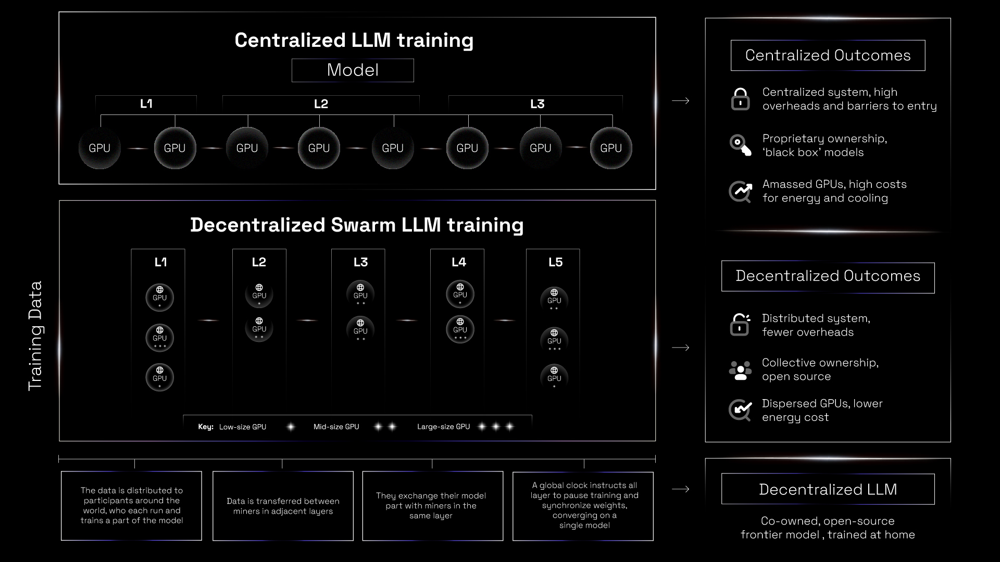

# Subnet 9 IOTA

In August 2024, Bittensor’s Subnet 9 (SN9) demonstrated that a distributed network of incentivized, permissionless actors could each pre-train large language models (LLMs) ranging from 700 million to 14 billion parameters, while surpassing established baselines. While that work validated blockchain-based decentralized pretraining as viable, it contained core issues: every miner had to fit an entire model locally, and “winner-takes-all” rewards encouraged model hoarding.&#x20;

Here we introduce IOTA (Incentivised Orchestrated Training Architecture), an architecture that addresses these limitations by transforming SN9’s previously isolated competitors into a single cooperating unit that can scale arbitrarily while still rewarding each contributor fairly. IOTA is a data- and pipeline-parallel training algorithm designed to operate on a network of heterogeneous, unreliable devices in adversarial and trustless environments. The result is a permissionless system that is capable of pre-training frontier-scale models without per-node GPU bloat, and tolerates unreliable devices and aligns participants through transparent token economics.

Various solutions attempt to solve key technical hurdles regarding distributed training but lack an incentive model, while others provide economic incentives but have yet to achieve the training performance of a coordinated cluster. IOTA bridges this gap by combining novel techniques that jointly tackle all three limitations.

<figure><figcaption>
Centralised vs decentralised LLM training
</figcaption></figure>

The technical primer doc [INCENTIVISED ORCHESTRATED TRAINING ARCHITECTURE\
(IOTA)](https://www.macrocosmos.ai/research/iota_primer.pdf) provides a detailed view of our pre-training efforts.

Have a look at the [Miners Dashboard](https://iota.macrocosmos.ai/) to get the updates on the training process.

<figure><figcaption></figcaption></figure>

For more details on how to contribute you can have a looks at [**mining instructions**](https://app.gitbook.com/o/eu9Z3qt7ycTIHIJGObFB/s/JDlWdmSC3GnzBPSkAiBM/~/changes/165/subnets/subnet-9-pre-training/subnet-9-iota-mining-setup-guide), and [**validating** **instructions**](https://app.gitbook.com/o/eu9Z3qt7ycTIHIJGObFB/s/JDlWdmSC3GnzBPSkAiBM/~/changes/165/subnets/subnet-9-pre-training/subnet-9-validating).

If you have any questions or require support, please message us in the [Bittensor Discord](https://discord.com/channels/799672011265015819/1162768567821930597) channel for subnet 9, or our own [Macrocosmos Discord](https://discord.gg/vRTaAXpRcd) server.

### Find out more

Have a look at [Training At Home (TAH)](../../product-and-services/tah/).

Read substack and other articles:

* [Why IOTA is different: Comparing Pretraining, Federated Learning, and Swarm](https://macrocosmosai.substack.com/p/why-iota-is-different-comparing-pretraining) - The Cosmonaut Substack, August 2025
* [Swarm Intelligence Is Reshaping How AI Gets Trained](https://www.forbes.com/sites/torconstantino/2025/06/02/swarm-intelligence-is-reshaping-how-ai-gets-trained/) - Forbes, July 2025
* [IOTA: Bittensor's biggest pretraining breakthrough is here](https://macrocosmosai.substack.com/p/iota-bittensors-biggest-pretraining) - The Cosmonaut Substack, June 2025

Other related resources

* [Website](https://www.macrocosmos.ai/sn9)
* [Dashboard](https://iota.macrocosmos.ai/)
* [GitHub](https://github.com/macrocosm-os/iota)
* [Substack](https://macrocosmosai.substack.com/t/pre-training)
* [Bittensor Discord](https://discord.com/channels/799672011265015819/1162768567821930597)
* [Macrocosmos Discord](https://discord.com/channels/1238450997848707082)
* [Cosmonauts - Macrocosmos Telegram](https://t.me/macrocosmosai)
* [Macrocosmos X](https://x.com/MacrocosmosAI)
