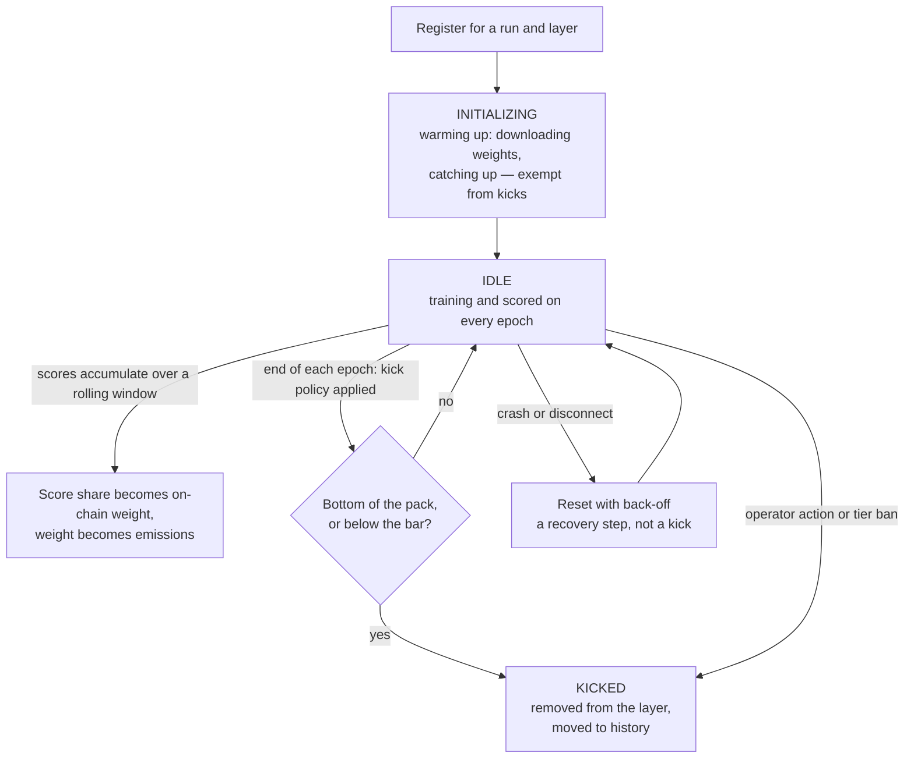
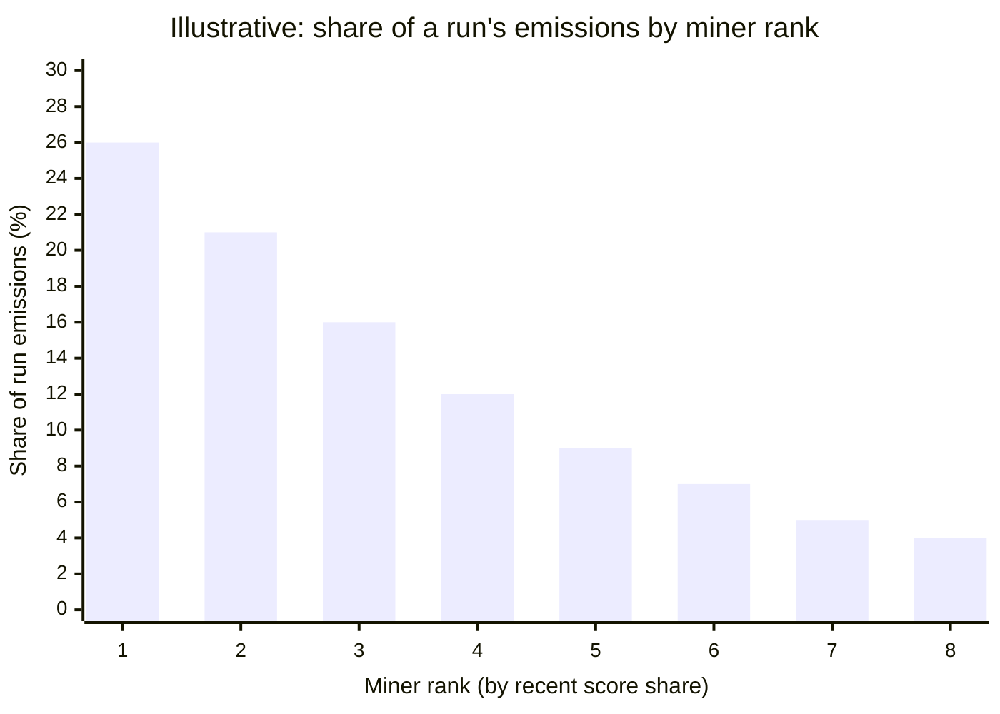
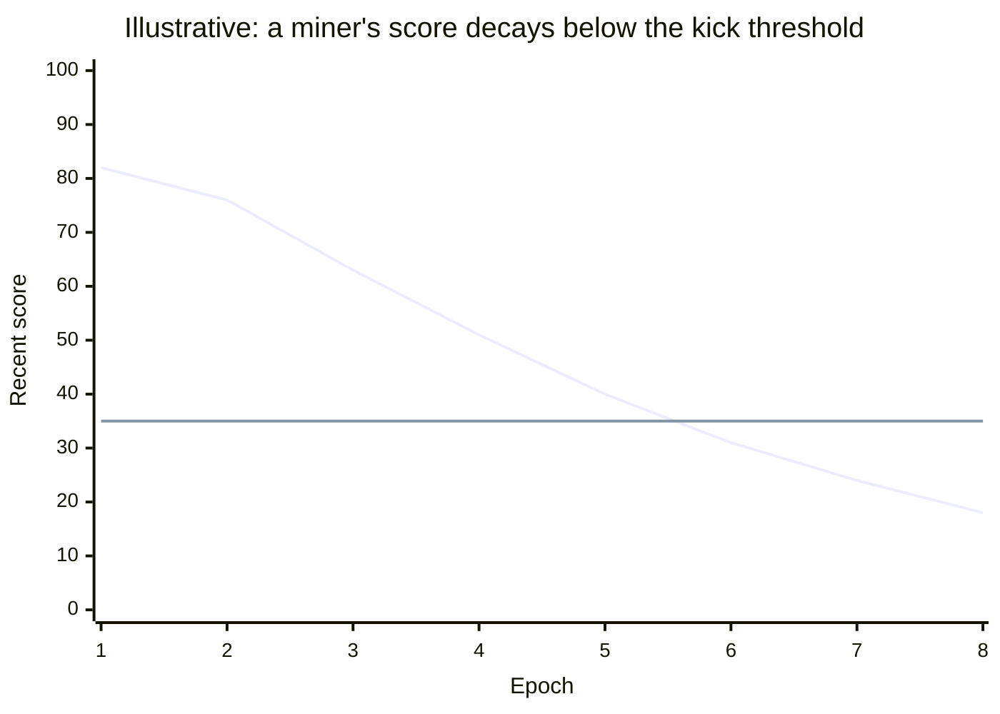
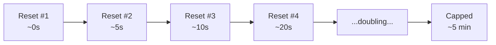

# Scoring, Rewards & Kicking

### Introduction

IOTA turns many independent, unreliable machines into a single cooperating training run. To keep that swarm honest and productive, the network has to answer three questions continuously:

1. **How good is each miner's contribution?** (scoring)
2. **How should emissions be shared based on that contribution?** (rewards)
3. **When should a miner be removed from the swarm?** (kicking)

This page explains the flow from raw work to on-chain rewards, why some nodes earn more than others, and the conditions under which a miner is removed. It stays at a conceptual level — the exact thresholds and configuration knobs live in the code and can change per training run.

### The miner lifecycle at a glance

Every miner moves through the same lifecycle. Scoring and kicking are not one-off events; they repeat on every training epoch for as long as the miner participates.


A newly registered miner starts in an **initializing** state while it downloads the current model weights and catches up with the swarm. During this warm-up it is **not eligible to be kicked** — a node is never penalized for the time it spends getting ready.


### How contributions are scored

Miners do not score themselves, and they are not scored on how much raw compute they claim to have spent. Instead, **validators** independently measure the **forward-pass activations** each miner produces during training and assign a score for the work done in each validation window.

Rather than a single "quality" number, scoring combines several independent checks that each look at the miner's activations from a different angle, for example:

* **Consistency over time** — does the miner's output behave coherently across successive steps, rather than jumping around randomly?
* **Agreement with peers** — do the miner's activations line up with what other honest miners on the same layer are producing?
* **Expected signal shape** — does the energy and structure of the activations match what genuine training produces?
* **Anti-gaming checks** — are there tell-tale patterns of repetition or shortcuts that suggest the miner is faking work rather than actually training?

Because several independent signals feed the score, a miner cannot do well by optimizing one trick — it has to actually contribute useful training work that holds up under all of the checks. Scores are collected continuously in short validation windows and are aggregated over a **rolling recent window** (on the order of a day), so a miner's standing reflects its recent behavior rather than one lucky or unlucky moment.

### How scores become emissions

Scores are converted to on-chain **weights**, and weights determine each miner's share of emissions. The path from work to reward is:



#### Aggregate recent scores

Each miner's scores from the recent window are summed into a single total for the run it is participating in. Miners can carry an individual multiplier that scales this total up or down; a contribution whose adjusted total comes out negative is dropped entirely rather than allowed to drag things down.



#### Take a share within the run

Within a training run, a miner's weight is its **share of the total score** produced by all miners in that run. Earn a larger slice of the run's verified work, earn a larger slice of that run's rewards.



#### Scale by the run's allocation

Each run controls a portion of the subnet's total emissions and may set aside a fraction of its own rewards to be burned. A run that only ran for part of the reward period contributes proportionally less. A miner's final weight is its in-run share scaled by these run-level settings.



#### Publish weights on-chain

All miners' weights are combined into a single vector that sums to one, normalized, and written to the Bittensor chain on a regular cadence — independent of how long an epoch takes. Emissions then flow to each miner in proportion to its published weight.



### The reward formula, and why layers are not equal

Putting those steps together, the on-chain **weight** for a miner _m_ in run _r_ — which its emissions are proportional to — is:

$$
\text{weight}_m = \underbrace{\frac{S_m}{\sum_{k \in r} S_k}}_{\text{share within run } r} \times (1 - b_r) \times \underbrace{w_r \cdot a_r}_{\text{effective run allocation}}
$$

Over the recent scoring window:

* $$S_m$$ — miner _m_'s **total score**: the sum of the validation scores it earned, multiplied by any individual multiplier. If that multiplied total is negative, the miner is dropped entirely.
* $$\sum_{k \in r} S_k$$ — the total score of **every miner in the run**, summed across all of its layers. This is the denominator each miner competes for a share of.
* $$b_r$$ — the run's **burn factor**: the fraction of the run's rewards that is burned rather than paid out.
* $$w_r$$ — the run's **incentive weight** (its slice of the subnet's emissions), and $$a_r$$ the fraction of the reward window the run was actually active. Their product $$w_r \cdot a_r$$ is the run's _effective_ allocation.

**Why the number of miners per layer is a key factor.** Work in IOTA is not spread evenly across the model. IOTA is pipeline-parallel: the model is split into layers, and each layer is staffed by a configurable number of miners (its `miners_per_layer`). Just as importantly, scoring is done on **forward-pass activations** — the outputs a miner produces on the forward pass — **not** on backward/gradient work. Because different layers run different volumes of forward passes and hold different numbers of miners, the **total amount of validated work — and therefore the total score available — genuinely differs from layer to layer.** The weighted number of miners on each layer is what makes the shared denominator $$\sum_{k \in r} S_k$$ a fair basis for comparison: a miner's share has to be read against the work its layer actually produced, rather than assuming every layer generated the same amount of scorable work.

### Why some miners earn more than others

Two miners in the same run can earn very different amounts. The differences come down to a few factors, in order of importance:

* **Quality and quantity of verified work.** The single biggest driver. A miner that consistently passes the validators' checks accumulates a larger $$S_m$$, and therefore a larger slice of emissions.
* **The layer they are on.** Because layers differ in their miner count and in how much forward-pass work they produce (see the formula above), the same effort can translate into a different score depending on where in the pipeline a miner sits.
* **Being in an active, well-allocated run.** Rewards are shared within a run and scaled by that run's effective allocation ($$w_r \cdot a_r$$), so the same score contributes differently depending on the run.
* **Individual multipliers.** Operators can apply a per-miner multiplier to adjust earnings without touching the scoring system itself.

The chart below is an illustration of how emissions concentrate toward the highest-scoring miners in a run — higher score share, disproportionately higher reward — rather than being split evenly.


There is no "winner-takes-all." Every contributor with positive, verified work earns a proportional share — but the share tracks contribution, so stronger miners are rewarded meaningfully more than weaker ones.


### Safeguards: caps and burning

Not every emission is paid to miners. Whatever is **not** earned by miners is **burned** (sent to the subnet owner), and several guardrails protect the system from misconfiguration or runaway payouts:

* **A ceiling on miner emissions.** There is a hard cap on the total share of emissions that can go to miners in a period. If contributions would push past that ceiling, the excess is burned rather than paid.
* **An over-allocation tripwire.** If the runs in a period ever claim more than 100% of emissions between them (a sign of a configuration error or a race during a run rotation), the system refuses to pay anyone for that period and burns everything, rather than paying out corrupted numbers.
* **The remainder is always burned.** The weight vector always sums to one; whatever miners collectively did not earn goes to the burn. This keeps the accounting transparent and auditable.

These are deliberately conservative: when in doubt, the network burns rather than mis-pays.

### How and when miners are kicked

Being kicked means a miner is removed from its layer, stops earning, and is moved to a history record (kept for audit — kicked miners are never silently deleted). There are three distinct ways this happens.


**Low scores do not automatically kick a miner.** Kicking is driven by a run's configured **policy**. A run can be set to never kick, and in that case even a poorly-scoring miner stays. Scores only matter for kicking when a policy says they do.


#### 1. Performance kicks (automatic, per epoch)

At the end of **every epoch**, once scoring for that epoch is complete, the run applies whichever kick policy it is configured with:

* **No-kick** — no one is removed on performance grounds.
* **Bottom-by-score** — the lowest-scoring _N_ miners on the layer are removed each epoch, regardless of their absolute scores. Even in a strong field, the tail gets trimmed.
* **Score-threshold** — every miner at or below a set score bar is removed.

Two protections apply to performance kicks:

* **Warm-up is exempt.** Miners still initializing are never performance-kicked.
* **A layer is never emptied or gutted.** If a policy would remove so many miners that the layer can't keep functioning, the kick is skipped for that epoch.

The time-series below illustrates the score-threshold case: a miner's recent score drifts down over successive epochs and, once it crosses below the bar, it is removed at the next epoch boundary.

The upper line is the miner's score; the flat line is the threshold. The miner drops below it around epoch 5 and is removed shortly after — note that removal happens **at an epoch boundary**, not the instant a score dips.

#### 2. Manual kicks (operator action, immediate)

An operator can remove a specific miner at any time through the orchestrator, independent of scores or epochs. This is used for clear-cut cases and records a reason for the audit trail.

#### 3. Tier bans (immediate, operator-level)

Operators belong to tiers, and a ban at the operator level removes **all** of that operator's active miners at once and blocks their pending registrations. This is the fastest lever for dealing with abuse.

### Recovery vs. removal: resets and back-off

Not every failure is a kick. When a miner crashes, disconnects, or falls out of sync, the orchestrator can **reset** it so it re-initializes and rejoins the same run and layer — this is recovery, not removal.

To keep a flaky node (or a fleet-wide hiccup) from hammering the system, resets use an **escalating, jittered back-off**: the first reset is immediate, and each subsequent reset waits longer — roughly doubling from a few seconds up to a cap of a few minutes — with random jitter so that many miners recovering at once don't all retry in lockstep.

A miner only leaves the swarm through one of the three kick paths above. Resets are designed to keep good-faith nodes participating through transient trouble.

### In summary

* Miners are **scored by validators** on the quality of verified forward-pass work, combining several independent checks and aggregated over a recent rolling window.
* **Emissions follow score share** within a run: $$\text{weight}_m = \frac{S_m}{\sum_{k \in r} S_k} \times (1 - b_r) \times w_r a_r$$ — scaled by the run's burn and effective allocation, then published on-chain. The number of miners per layer matters, because layers do different amounts of forward-pass work.
* **Guardrails burn** anything above the miner-emissions ceiling, and refuse to pay at all if allocations are over-committed.
* **Kicking is policy-driven**, evaluated per epoch: bottom-by-score, below-threshold, or disabled — with warm-up and layer-health protections. Operators can also kick manually or ban an entire tier.
* **Resets with back-off** recover struggling nodes; only a kick actually removes a miner, and every removal is recorded.
