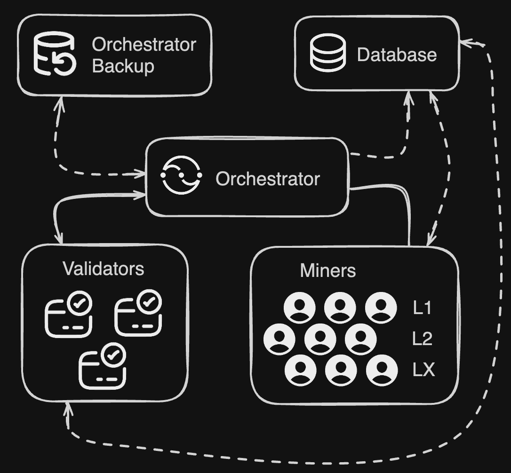

# Incentive Mechanism

### System Architecture

IOTA is structured around three core roles: the Orchestrator, Miners, and Validators. The simplified design of the system is illustrated in Figure 1. Rather than adopting a fully peer-to-peer topology, IOTA follows a hub-and-spoke architecture centred around the Orchestrator. This design choice ensures global visibility and enables comprehensive monitoring of all interactions between participants, which is critical for enforcing incentives, auditing behavior, and maintaining system integrity.

<figure><figcaption>
Figure 1 - Overall system architecture
</figcaption></figure>

The orchestrator facilitates the training process by triggering miners to work on specific layers of the model, further triggering when validation should occur based on the progress of the miners.

This architecture allows a system-level orchestrator to manage how participants on the network will operate at different stages of the training process. All data that is created and handled by these three entities is pushed to a globally accessible database, making it easy to trace the movement of information.

#### Orchestrator

The orchestrator’s primary responsibility is to monitor the training progress of each miner over all discrete layers and initiate weight-merging events accordingly. Given the heterogeneous nature of miner hardware and their unreliability, it is impractical to wait for all miners to complete an equal number of batches B. Instead, we define a minimum batch threshold, $$B_{min}$$, that a miner must complete for its contribution to be considered in the merging process. Once at least a specified fraction of miners have trained for at least $$B_{min}$$ batches, the orchestrator prompts all qualifying miners to upload their weights.

$$
B_{\text{eff}}
   \;=\;
   \sum_{m=1}^{M}
   \begin{cases}
      B_{m} & \text{if } B_{m} \ge B_{\min} \\
      0     & \text{if } B_{m} <  B_{\min}
   \end{cases}
$$

where _M_ is the total number of miners and $$B_{min}$$ is the number of batches completed by miner _m_.\
This mechanism draws inspiration from centralised training practices—where $$B_{eff}$$ mimics the behavior of global batch sizes in typical LLM training—but in the decentralised setting it is coupled with DiLoCo, which enables miners to perform local optimisation steps independently before synchronization. DiLoCo is particularly well suited for this paradigm, as it:

* Embraces partial participation from miners,
* Supports asynchronous and layer-wise updates, and
* Reduces communication overhead by focusing on the most informative coordinate updates locally.

#### Miners

Miners may register to the subnetwork at any time. Upon registration, the orchestrator assigns each miner a model layer to train. The miner will wait until the next full synchronization period to start actively participating. During the full synchronisation, it will update its weights and optimizer states to align with the rest of the network, and can then proceed to processing forward and backward activations in the training stage.

More details on mining on the subnet you can get from the  [IOTA Mining Setup Guide](https://docs.macrocosmos.ai/subnets/subnet-9-pre-training/subnet-9-iota-mining-setup-guide).

#### Validators

Within the system, validators play a core role in determining if the work completed by the miner was honest. Primarily, the validator relies on computational reproducibility to achieve this validation signal. As the validator is tracking a specific miner, a portion of the miner’s training is completely rerun on the validator side. Forward and backwards passes are checked against the submitted miner activations using a cosine similarity. However, there are many complications when it comes to reliable validation, and we explore them in the remainder of the paper. We formalize incentivization in\
the next section, and add additional exploratory techniques leveraging Shapley values for anomaly detection and adversarial robustness in Section 6 of the primer doc [INCENTIVISED ORCHESTRATED TRAINING ARCHITECTURE(IOTA)](https://www.macrocosmos.ai/research/iota_primer.pdf).

### Incentivisation

The design of the incentive landscape for the network participants should consider the trade-offs between optimisation and reproducibility, and has significant impact on the dynamics of the system. As discussed above, validation hinges on the validator’s ability to reproduce sections of training to a chosen threshold. Given this condition, the design does not give power to the miner to innovate algorithmically at this time.

Validators continuously monitor randomly assigned miners throughout full sync stages to ensure comprehensive oversight. To maximise validation coverage, the initial implementation of IOTA employs the shortest possible monitoring period (utilizing 0 compressed sharing stages), enabling each validator to oversee the maximum number of miners within the network. Importantly, miners are not aware of when they are being monitored, preventing them from selectively behaving correctly only during observed intervals. Upon completion of a validation stage, the mining rewards are calculated based on the total number of backward passes successfully processed, $$S~$$$$S^n_m$$, where _m_ indexes the\
miner and _n_ indexes the validation epoch.

The system implements a temporal decay mechanism governed by hyperparameter γ, which determines the decay time. The weight decay for miner _m_ in epoch follows a step function – concretely this means that a miner is assigned a fixed amount of "score" for a time period γ, after which the score drops to 0:

$$
w(t)^n_m=
\begin{cases}
  1 & \text{if } t \le t_{\text{decay}} \\
  0 & \text{if } t >  t_{\text{decay}}
\end{cases}
$$

where t is the time since the score was initially assigned. Therefore, the raw incentive I is the sum over all scores multiplied by their time weighting factor $$w(t)^n_m$$

$$
I_{m} \;=\; \sum_{n=0}^{N} S_{m}^{n}\,\cdot\, w(t)_{m}^{n}
$$

where N is the total number of full synchronisation steps at that point of time. This simple linear reward structure ensures miners receive fixed compensation per processed activation, eliminating incentives for throughput manipulation or other gaming strategies during non-validation periods. The exact recomputation requirement during validation stages provides additional security against system exploitation. 
