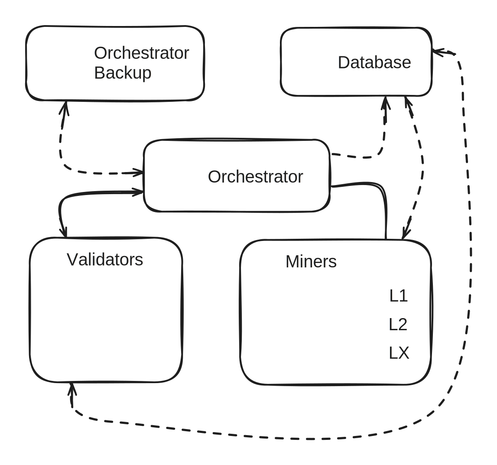

# Subnet 9: Incentive Mechanism

### System Architecture

IOTA is structured around three core roles: the Orchestrator, Miners, and Validators. The simplified design of the system is illustrated in Figure 1. Rather than adopting a fully peer-to-peer topology, IOTA follows a hub-and-spoke architecture centred around the Orchestrator. This design choice ensures global visibility and enables comprehensive monitoring of all interactions between participants, which is critical for enforcing incentives, auditing behavior, and maintaining system integrity.

Overall system architecture. The orchestrator facilitates the training process by triggering miners to work on specific layers of the model, further triggering when validation should occur based on the progress of the miners.

This architecture allows a system-level orchestrator to manage how participants on the network will operate at different stages of the training process. All data that is created and handled by these three entities is pushed to a globally accessible database, making it easy to trace the movement of information.

### Incentivisation

The design of the incentive landscape for the network participants should consider the trade-offs between optimisation and reproducibility, and has significant impact on the dynamics of the system. As discussed above, validation hinges on the validator’s ability to reproduce sections of training to a chosen threshold. Given this condition, the design does not give power to the miner to innovate algorithmically at this time.

Validators continuously monitor randomly assigned miners throughout full sync stages to ensure comprehensive oversight. To maximise validation coverage, the initial implementation of IOTA employs the shortest possible monitoring period (utilizing 0 compressed sharing stages), enabling each validator to oversee the maximum number of miners within the network. Importantly, miners are not aware of when they are being monitored, preventing them from selectively behaving correctly only during observed intervals. Upon completion of a validation stage, the mining rewards are calculated based on the total number of backward passes successfully processed, $$S~$$$$S^n_m$$, where _m_ indexes the\
miner and _n_ indexes the validation epoch.

The system implements a temporal decay mechanism governed by hyperparameter γ, which determines the decay time. The weight decay for miner _m_ in epoch follows a step function – concretely this means that a miner is assigned a fixed amount of "score" for a time period γ, after which the score drops to 0:

$$
w(t)^n_m=
\begin{cases}
  1 & \text{if } t \le t_{\text{decay}} \\
  0 & \text{if } t >  t_{\text{decay}}
\end{cases}
$$

where t is the time since the score was initially assigned. Therefore, the raw incentive I is the sum over all scores multiplied by their time weighting factor $$w(t)^n_m$$

$$
I_{m} \;=\; \sum_{n=0}^{N} S_{m}^{n}\,\cdot\, w(t)_{m}^{n}
$$

where N is the total number of full synchronisation steps at that point of time. This simple linear reward structure ensures miners receive fixed compensation per processed activation, eliminating incentives for throughput manipulation or other gaming strategies during non-validation periods. The exact recomputation requirement during validation stages provides additional security against system exploitation.\
