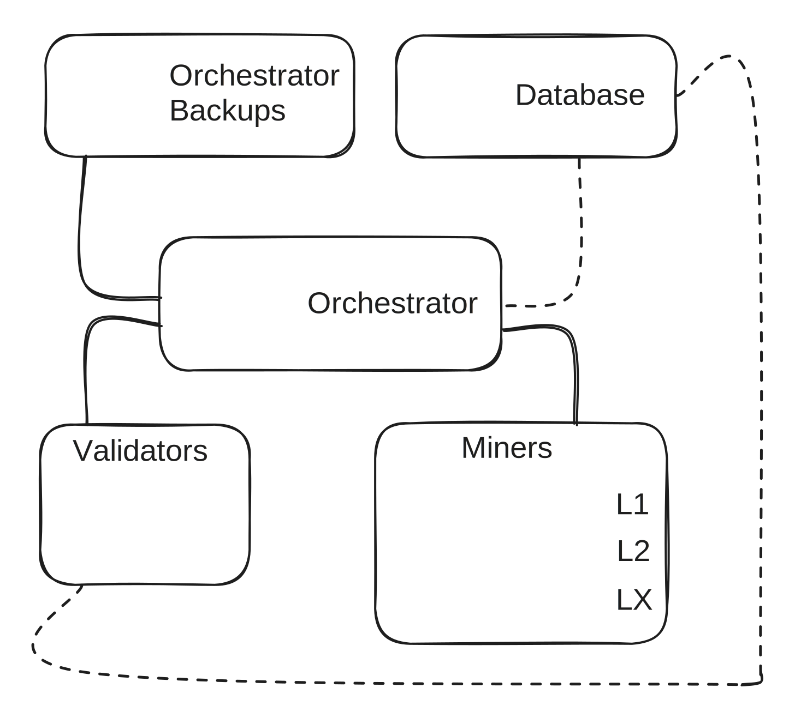

# Subnet 9 IOTA Mining Setup Guide

## Introduction

IOTA (Incentivized Orchestrated Training Architecture) is a data- and pipeline-parallel training algorithm designed to operate on a network of heterogeneous, unreliable devices in adversarial and trustless environments.&#x20;

## Miners purpose in IOTA

In a decentralized LLM-training network, miners are the workers that supply GPU compute, memory, and bandwidth to collaboratively train models. IOTA utilizes data- and pipeline-parallelism, meaning that miners run sections of the model rather than its entirety. This reduces the hardware requirement for participation. Each miner downloads its assigned section of the model, runs forwards and backward passes of activations and periodically sync their weights with peers in the same layer via a merging process. By distributing workloads across a large number of independent miners, the network achieves massive parallelism, fault tolerance, and censorship resistance while eliminating single-point infrastructure costs.&#x20;

The IOTA incentive mechanism continuously scores miners on throughput and the quality of their work during the training and merging processes. In turn, they are rewarded with subnet 9 alpha tokens based on the quality of their contributions.

## Operations explained

### Joining the network

Miners join the network and get registered with the orchestrator using their API client, which assigns them to a training layer. Up to 50 miners operate per layer. Miners download the current global weights for their layer and begin processing activations.

### Activations

There are two activation types: forward and backward.

* Forwards activations propagate samples through the model to produce losses.
* Backwards activations propagate the samples in the opposite direction to produce gradients for training their layer weights.

Backwards activations are given precedence over forwards activations as they provide the learning signal.

If a miner fails to process an activation that it has been assigned, it is penalized. This is like an assembly line, where workers pass between adjacent stages in the process. An important part of the design is that samples propagate through the pipeline in random and stochastic paths.

Activation processing happens in all layers at once, but miners process samples and train asynchronously. Miners must process as many activations as possible in each epoch — their score is based on throughput.

### Merging

Once the orchestrator signals that enough samples have been processed in the network, the state of the system changes from training mode to merging mode.&#x20;

In merging mode, the miners perform a multi-stage process which is a modified version of Butterfly All-Reduce.&#x20;

1. Miners upload their local weights and optimiser states to the s3 bucket.&#x20;
2. They are assigned a set of random weight partitions.&#x20;

Importantly, multiple miners are assigned to the same partitions which provides redundant measurement of results for improved fault tolerance and robustness!&#x20;

3. Miners then must download their partitions, perform a local merge (currently the element-wise geometric mean) and then upload their merged partitions.&#x20;

This design is tolerant to miner failures, so merging is not blocked if some miners do not successfully complete this stage.&#x20;

5. Finally, miners download the complete set of merged weights and optimiser states. The merging stage is currently the slowest, so we amortise this by running the training stage for longer and effectively training on larger batch sizes.

Once merging is complete, the orchestrator state returns to training mode and the miners continue processing activations. The miners cycle between training mode and merging mode in perpetuity.

Figure 1 below illustrates the training loop.



Figure 1 Explanation - While inside the training loop, the miner is responsible for performing forward and backward passes while uploading their activations to the dedicated storage bucket. In the forward direction, miners receive activations from the previous layer, compute transformed outputs, and propagate them downstream. During the backward pass, they consume gradients, compute local weight updates, and send gradients upstream. Importantly, the number of forward and backward passes per training loop is controlled via an orchestrator level hyperparameter called BATCHES\_BEFORE\_MERGING.

For the details on validating, please follow the link -> Validation

## Setting Up Mining

This section provides an instruction on the IOTA miner set up. The setting up process is described as a full flow, assuming use of the Terminal. Some operations should be adjusted, when using any UI dev tools for set up. At the bottom of the page you may find instructions on RunPod setup examples for the ones who are not familiar with infrastructure setup.

Before working with subnet 9, you should familiarize yourself with the [Bittensor documentation](https://docs.bittensor.com/), describing the ecosystem and relationships between network participants.

If you have any questions, not covered in the instruction or facing issues with installation, reach us out for support in:

* ​[Macrocosmos Discord](https://discord.com/channels/1238450997848707082)
* [Bittensor Discord](https://discord.com/channels/799672011265015819/1162768567821930597)

### Prerequisites

To start setting up the miner on IOTA requires:

* Bittensor wallet - [set up instructions](https://docs.bittensor.com/working-with-keys)
* Training infrastructure:\
  Miners must run on GPUs with at least 80 GB of VRAM (A100-class or higher); hardware with less memory will process updates more slowly and consequently may earn markedly lower rewards.
* Basic HuggingFace Access token to pull the model from HuggingFace - no need to modify the permissions

### Installation

1.  Provide the files executable rights to run on your local machine

    ```python
    # Provide the files executable rights to run on your local machine
    cd .ssh
    vim id_rsa
    chmod 0400 ~/.ssh/id_rsa

    #Clone the repository
    cd workspace
    git clone https://github.com/macrocosm-os/IOTA.git
    cd IOTA
    bash

    #Check uv version
    uv –version

    #Install dependencies
    cd IOTA
    uv sync

    #Install bittensor cli
    pip install bittensor-cli

    #Optional - update the bittensor-cli, if a new version is available
    python -m pip install --upgrade pip
    ```

### Bittensor Wallet Registraton

```python
# Regenerate the coldkey: create a name of the wallet = coldkey name and provide your Bittensor Wallet mnemonic key.
btcli w regen_coldkey

# Regenerate the hotkey: Provide your wallet (just created coldkey name) and create a name of the hotkey (do not insert your actual key symbolic combination).
btcli w regen_hotkey

#Check your wallets balance
btcli wallets balance
```

### Miner Registration and Launch

#### Register on Mainnet

```python
# Activate virtual environment
source .venv/bin/activate

# Register on the mainnet (finney)
btcli s register --netuid 9 --wallet.name [wallet_name] --wallet.hotkey [wallet.hotkey]
```

**Change miner values, where necessary, and copy them:**

wallet\_name="wallet\_name" #change the wallet\_name to your wallet name (coldkey name)

wallet\_hotkey="wallet\_hotkey" #change the wallet\_hotkey to your hotkey name

netuid=9

network="finney"

MOCK=False

BITTENSOR=True

HF\_TOKEN="hf\_token"


```python
#Edit miners file with required values
vim .env

# For Terminal - use a key combination to paste the miner values: Ctrl + Shift + V (Cmd + V)
:wq

#For the UI enabled tools just change the values in the miner's .env file

#Launch the miner
source .venv/bin/activate
python launch_miner.py
```

Expected output:

<figure><figcaption></figcaption></figure>

🎉Congratulations! You have set up the miner and are able to contribute to the world of breaking edge innovation!\


\
