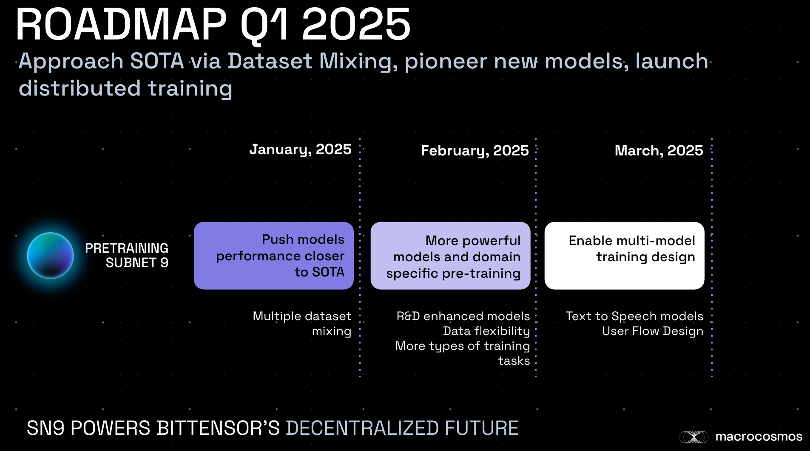

# Subnet 9: Roadmap

The Q1 Roadmap as completed 31 March 2025. The roadmap for Q2 2025 will be published by 15 April, 2025.

The subnet 9 team is conducting market research on revenue generation through training and fine-tuning multimodal models on demand. The current subnet architecture and incentives proved to provide LLMs that push boundaries and get closer to closed-source SOTA. The technical roadmap below outlines necessary steps to increase the flexibility, productisation, and competitiveness of the subnet, enabling revenue potential and tapping into the significant spend associated with model training globally.

<figure><figcaption>
Q1 2025 SN9 Roadmap
</figcaption></figure>

